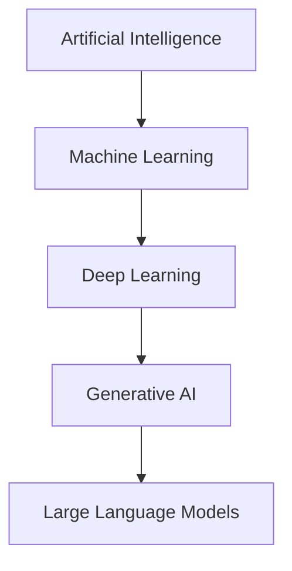
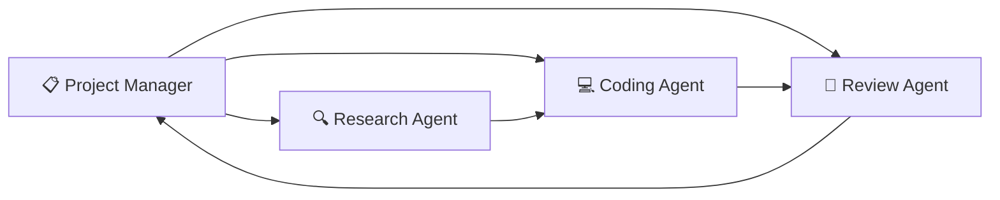

# 🤖 Python-programmering med AI og Agentiske Systemer

<div align="center">


### 🎓 Valgfag – 3. Semester

### IT-Teknolog Programmet | Zealand

</div>

---

## 🌟 Kursusoversigt

> Dette kursus introducerer de studerende til moderne Python-programmering for udvikling af AI-løsninger med fokus på **Agentic AI**, **Large Language Models (LLMs)** og **Multi-Agent Systemer**.

### 🚀 Du lærer at bygge AI-systemer som kan:

* 🧠 Ræsonnere
* 📋 Planlægge
* 🔧 Anvende værktøjer
* 🌐 Kalde API'er
* 📊 Analysere data
* 🤝 Samarbejde med andre AI-agenter

---

# 🎯 Læringsmål

## 📚 Viden

Efter kurset kan du:

✅ Forklare Python til AI-udvikling

✅ Beskrive:

* Artificial Intelligence (AI)
* Machine Learning (ML)
* Deep Learning (DL)
* Generativ AI
* Large Language Models (LLMs)

✅ Forklare Agentic AI arkitekturer

✅ Forstå Prompt Engineering

---

## 🛠️ Færdigheder

Du kan:

| Færdighed            | Niveau |
| -------------------- | ------ |
| Python AI Apps       | ⭐⭐⭐⭐⭐  |
| LLM API Integration  | ⭐⭐⭐⭐⭐  |
| AI Agents            | ⭐⭐⭐⭐⭐  |
| RAG Systemer         | ⭐⭐⭐⭐   |
| Multi-Agent Systemer | ⭐⭐⭐⭐   |

---

## 🏆 Kompetencer

* 🚀 Designe komplette AI-løsninger
* ⚖️ Vurdere etiske og juridiske aspekter
* 👥 Arbejde i AI-udviklingsteams
* ☁️ Deploye AI-systemer

---

# 📅 Kursusplan

## 🐍 Uge 1 — Automatisering med Python

### Emner

* Rapportgenerering 📄
* Filorganisering 📁
* Databehandling 📊
* E-mail automatisering 📧

### Hands-on

```python
import pandas as pd

data = pd.read_excel("sales.xlsx")
report = data.groupby("month").sum()
report.to_excel("monthly_report.xlsx")
```

---

## 🤖 Uge 2 — Introduktion til Kunstig Intelligens

### AI-Landskabet



### Hands-on

* Kør prætrænede modeller
* Model inferens i Python

---

## 💬 Uge 3 — Store Sprogmodeller & Prompt Engineering

### Emner

* Prompt Design
* Structured Output
* Function Calling
* AI Assistenter

### Projekt

🧑‍💻 Byg din egen ChatGPT-lignende assistent

---

## 🧠 Uge 4 — Agentiske AI-Systemer

### Frameworks

| Framework  | Fokus             |
| ---------- | ----------------- |
| OpenAI SDK | LLM Integration   |
| LangChain  | AI Workflows      |
| LangGraph  | Agent Flows       |
| CrewAI     | Multi-Agent Teams |

### Projekt

🤖 Byg en autonom AI Agent

---

## 📚 Uge 5 — Retrieval-Augmented Generation (RAG)

### Teknologier

* 🔎 Embeddings
* 📦 Vector Databases
* 🧠 Semantic Search

### Platforme

| Teknologi | Type            |
| --------- | --------------- |
| ChromaDB  | Open Source     |
| FAISS     | Local Vector DB |
| Pinecone  | Cloud Vector DB |

### Projekt

📖 Dokumentbaseret AI Assistent

---

## 👥 Uge 6 — Multi-Agent Systemer

### AI Team



### Projekt

Udvikl et komplet AI-team bestående af:

* 🔍 Research Agent
* 💻 Coding Agent
* 🧐 Review Agent
* 📋 Projektleder Agent

---

# 🎓 Mulige Eksamensprojekter

| Projekt                          | Sværhedsgrad |
| -------------------------------- | ------------ |
| 🤖 AI Forskningsassistent        | ⭐⭐⭐          |
| 📚 Personlig Vidensagent         | ⭐⭐⭐          |
| 👨‍💻 Multi-Agent Udviklingsteam | ⭐⭐⭐⭐⭐        |
| 🎓 AI Studievejleder             | ⭐⭐⭐          |
| 📞 Kundeservice Agent            | ⭐⭐⭐          |
| 📄 Dokumentanalyse System        | ⭐⭐⭐⭐         |
| 📊 Autonom Dataanalytiker        | ⭐⭐⭐⭐         |
| 📋 AI Projektleder               | ⭐⭐⭐⭐⭐        |

---

# 🧰 Teknologistak

## Programmering

* 🐍 Python

## AI Frameworks

* OpenAI SDK
* LangChain
* LangGraph
* CrewAI

## RAG

* ChromaDB
* FAISS
* Pinecone

## AI Modeller

* GPT-modeller
* Open Source LLMs
* Embedding Modeller

---

# 📋 Forudsætninger

> 💡 Grundlæggende Python-programmering anbefales.

✅ Ingen tidligere erfaring med AI kræves.

---

# 🚀 Efter Kurset

Du vil kunne udvikle moderne AI-systemer baseret på:

* 🤖 Agentic AI
* 🧠 Large Language Models
* 📚 RAG
* 👥 Multi-Agent Systemer
* ☁️ Cloud-baserede AI-løsninger

---

<div align="center">

## 🌟 Fremtidens softwareudvikling er AI-drevet

**Build • Reason • Automate • Collaborate**

</div>
