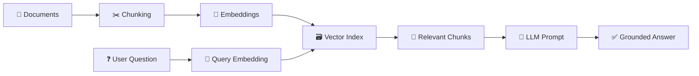
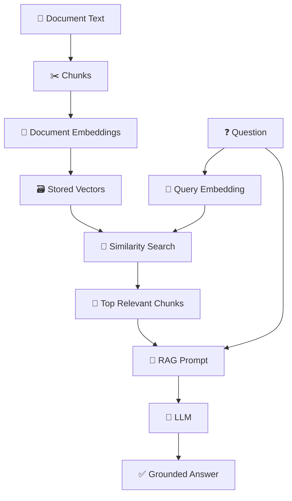
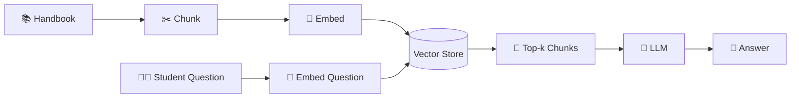
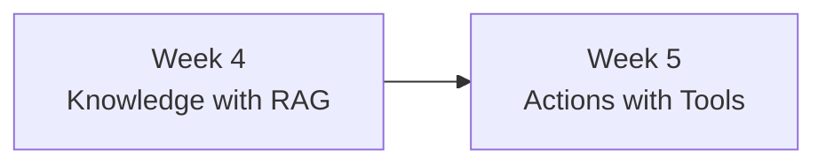

# 🟢 Week 4 — Documents + Retrieval-Augmented Generation (RAG)

## 📚 Teach an LLM to Answer from Your Own Documents


> 🎯 **Big idea:** Instead of expecting an LLM to know every fact, retrieve the most relevant information from your documents and give that evidence to the model before it answers.

---

## 🧭 Learning Journey



In earlier weeks, students learned to communicate with an LLM and engineer prompts. A new problem now appears: **what happens when the answer is inside a private document, a course handbook, a company policy, a technical manual, or a collection of notes that the model was never trained on?**

One option is to paste the entire document into every prompt. That quickly becomes inefficient and difficult to maintain. Another option is fine-tuning, but fine-tuning is normally intended to change model behavior or teach patterns—not to provide a simple, constantly changing knowledge base.

**Retrieval-Augmented Generation (RAG)** solves a different problem. It retrieves relevant information first and then asks the LLM to answer using that retrieved evidence.

---

# 🎯 1. Learning Objectives

After Week 4, students should be able to:

- explain the purpose of RAG;
- distinguish model knowledge from retrieved knowledge;
- load and split documents in Python;
- explain what text chunks are;
- explain embeddings at a conceptual level;
- calculate similarity between a question and document chunks;
- retrieve the most relevant chunks;
- build a small RAG pipeline with Python and Ollama;
- design prompts that encourage grounded answers;
- evaluate retrieval quality and answer quality; and
- build a document question-answering assistant.

---

# 🧠 2. Why Do We Need RAG?

Imagine that your college has a student handbook containing information about:

```text
Examination rules
Attendance
Internships
Project submission
Laboratory access
Contact procedures
```

A student asks:

```text
How many attempts do I have for an examination?
```

A general-purpose LLM may answer confidently, but it does not automatically know the current rules in *your* handbook.

The safer architecture is:

```text
Student Question
      │
      ▼
Search the Handbook
      │
      ▼
Find Relevant Paragraphs
      │
      ▼
Give Those Paragraphs to the LLM
      │
      ▼
Generate an Answer from the Evidence
```

That is RAG.


---

# 🔍 3. RAG vs a Normal LLM Prompt

### Normal LLM

```text
Question
   │
   ▼
LLM
   │
   ▼
Answer from model knowledge
```

### RAG

```text
Question
   │
   ├───────────────┐
   ▼               │
Retriever          │
   │               │
   ▼               │
Relevant Context   │
   │               │
   └──────► LLM ◄──┘
               │
               ▼
        Grounded Answer
```

> 💡 **Teaching message:** The LLM is still generating the final language. RAG changes *what evidence the model sees before it generates*.

---

# ✂️ 4. Step One — Load and Chunk Documents

Large documents are normally split into smaller units called **chunks**.

Suppose a document contains 20,000 words. Sending all 20,000 words for every question is unnecessary if the answer is contained in only one paragraph.

A simple teaching chunker can split text by words:

```python
def chunk_text(text, chunk_size=120):
    words = text.split()
    chunks = []

    for start in range(0, len(words), chunk_size):
        chunk = words[start:start + chunk_size]
        chunks.append(" ".join(chunk))

    return chunks
```

Example:

```text
Large Document
      │
      ▼
┌─────────────┐
│ Chunk 1     │
├─────────────┤
│ Chunk 2     │
├─────────────┤
│ Chunk 3     │
├─────────────┤
│ ...         │
└─────────────┘
```

### Chunk-size trade-off

| Small chunks | Large chunks |
|---|---|
| More precise retrieval | More surrounding context |
| May lose context | May contain unrelated information |
| More chunks to search | Fewer chunks to search |

There is no universal best chunk size. Students should **test** it.

---

# 🔢 5. Step Two — What Is an Embedding?

An embedding converts text into a vector of numbers representing its semantic meaning.

Conceptually:

```text
"Python uses indentation"
          │
          ▼
     Embedding Model
          │
          ▼
[0.08, -0.17, 0.41, 0.03, ...]
```

Text with similar meaning should produce vectors that are closer together than unrelated text.

For example:

```text
"How do I reset my password?"
          ≈
"I forgot my login password."

but

"How do I reset my password?"
          ≠
"What is the lunch menu?"
```

Ollama currently exposes an embedding API and recommends using the same embedding model for indexing and querying; its documentation also describes cosine similarity as a common choice for semantic search.

Install the Python package:

```bash
pip install ollama numpy
```

Generate an embedding:

```python
import ollama

response = ollama.embed(
    model="embeddinggemma",
    input="Python uses indentation to define code blocks."
)

vector = response["embeddings"][0]
print(len(vector))
```

---

# 📐 6. Step Three — Similarity Search

We need a way to compare the query vector with each document vector.

A common measure is **cosine similarity**.

For a beginner-friendly implementation:

```python
import numpy as np


def cosine_similarity(a, b):
    a = np.array(a)
    b = np.array(b)

    return np.dot(a, b) / (
        np.linalg.norm(a) * np.linalg.norm(b)
    )
```

Interpretation:

```text
Higher similarity
      ↓
More semantically related
      ↓
Better retrieval candidate
```

---

# 🗃 7. Step Four — Build a Tiny Vector Store in Python

For the first classroom implementation, students do **not** need a production vector database.

A Python list is enough to understand the idea.

```python
documents = [
    "Students must submit the project before Friday at 12:00.",
    "The laboratory is open from 08:00 until 16:00.",
    "Students should contact the internship coordinator for placement questions.",
    "A password can be reset through the student portal."
]
```

Create embeddings for all chunks:

```python
import ollama

embedding_response = ollama.embed(
    model="embeddinggemma",
    input=documents
)

vectors = embedding_response["embeddings"]
```

Now `documents[i]` and `vectors[i]` represent the same item.

---

# 🔎 8. Step Five — Retrieve Relevant Chunks

```python
import numpy as np
import ollama


def cosine_similarity(a, b):
    a = np.array(a)
    b = np.array(b)
    return np.dot(a, b) / (
        np.linalg.norm(a) * np.linalg.norm(b)
    )


def retrieve(question, documents, vectors, top_k=2):
    query = ollama.embed(
        model="embeddinggemma",
        input=question
    )["embeddings"][0]

    scored = []

    for text, vector in zip(documents, vectors):
        score = cosine_similarity(query, vector)
        scored.append((score, text))

    scored.sort(reverse=True, key=lambda item: item[0])

    return scored[:top_k]
```

Test it:

```python
results = retrieve(
    "How can I change my password?",
    documents,
    vectors
)

for score, text in results:
    print(score, text)
```

The retrieval stage is independent from the LLM answer stage.

That distinction is essential.

---

# 🤖 9. Step Six — Give Retrieved Context to the LLM

Now build a prompt from the retrieved chunks.

```python
from ollama import chat


def answer_question(question, retrieved_chunks):
    context = "\n\n".join(
        text for score, text in retrieved_chunks
    )

    prompt = f"""
You are a document question-answering assistant.

Answer the question using only the context below.
If the context does not contain the answer, say:
"I cannot find that information in the provided documents."

CONTEXT:
{context}

QUESTION:
{question}
"""

    response = chat(
        model="gemma3",
        messages=[
            {"role": "user", "content": prompt}
        ]
    )

    return response.message.content
```

The complete flow is now:



---

# 🧪 10. RAG Evaluation: Two Systems Must Work

RAG contains at least two major stages:

```text
Retrieval Quality
      +
Generation Quality
      =
RAG Quality
```

If retrieval fails, a perfect prompt cannot recover the missing evidence.

If retrieval succeeds but the LLM ignores the evidence, the final answer can still fail.

### Retrieval questions

- Did we retrieve the correct chunk?
- Was the relevant chunk inside the top 3?
- Is the chunk too small or too large?

### Answer questions

- Is the answer supported by the retrieved text?
- Did the model invent unsupported details?
- Did it correctly refuse when the answer was absent?


---

# 🧪 11. Classroom Activity — Human RAG

Before programming, give five printed paragraphs to different groups.

Ask:

> **Question:** What is the deadline for the final project?

One group acts as the **retriever** and finds the most relevant paragraph.

Another group acts as the **LLM** and is allowed to answer using only the retrieved paragraph.

This makes the architecture tangible:

```text
Class = Vector Store
Retriever Group = Search
LLM Group = Generator
```

Then intentionally give the LLM group the wrong paragraph and ask what happens.

Students quickly understand that **retrieval quality controls answer quality**.

---

# 🏆 12. Week 4 Main Assignment — Course Handbook RAG Assistant

## Scenario

Your institution wants a prototype assistant that answers student questions using a local handbook.

### Required features

Students should:

1. load at least one text or Markdown document;
2. split the document into chunks;
3. generate embeddings;
4. store chunk text and vectors;
5. accept a user question;
6. retrieve the top relevant chunks;
7. send only relevant context to an LLM;
8. answer using the context;
9. refuse when the answer cannot be found; and
10. display the retrieved chunks for debugging.

### Suggested questions

```text
When is the project deadline?
How do I contact the internship coordinator?
When is the laboratory open?
How can a student reset a password?
```

### Architecture



---

# 📊 13. Suggested Evaluation Table

| Question | Correct chunk in Top-3? | Answer grounded? | Correct refusal? |
|---|---:|---:|---:|
| Q1 | ✅/❌ | ✅/❌ | N/A |
| Q2 | ✅/❌ | ✅/❌ | N/A |
| Q3 | ✅/❌ | ✅/❌ | ✅/❌ |

Students should test at least one question whose answer is **not** in the documents.

---

# ⚠️ 14. Common RAG Problems

### Problem: Chunks are too large

Retrieval returns a lot of irrelevant text.

### Problem: Chunks are too small

Important context is split across chunks.

### Problem: Wrong embedding model at query time

Indexing and querying become inconsistent.

### Problem: Top-k is too low

The needed chunk may be missed.

### Problem: Weak grounding prompt

The LLM may add unsupported knowledge.

### Problem: No evaluation

The system appears impressive but fails on realistic questions.

---

# ✅ 15. RAG Checklist

```text
📄 Do I have clean source documents?
✂️ Is my chunking reasonable?
🔢 Did I embed documents and queries consistently?
🔎 Does retrieval find the right evidence?
🧩 Does the prompt clearly separate context from question?
🚫 Can the model say "I don't know" when evidence is missing?
📊 Do I test retrieval and final answers separately?
```

---

# ⏰ 16. Suggested Three-Hour Lesson

| Time | Activity |
|---|---|
| 00:00–00:20 | Why normal LLMs need external knowledge |
| 00:20–00:40 | RAG architecture |
| 00:40–01:00 | Documents and chunking |
| 01:00–01:25 | Embeddings and similarity |
| 01:25–01:40 | Break |
| 01:40–02:05 | Build simple retrieval in Python |
| 02:05–02:30 | Add the LLM generation step |
| 02:30–02:50 | Evaluate retrieval and grounding |
| 02:50–03:00 | Assignment briefing |

---

# ➡️ 17. Connection to Week 5

RAG gives the LLM **knowledge**.

But sometimes the assistant must do more than answer questions.

It may need to:

```text
Check a database
Calculate a value
Look up a ticket
Create a support request
Call another service
```

That requires **tools**.



---

# 🔗 Official References

- Ollama Embeddings: https://docs.ollama.com/capabilities/embeddings
- Ollama Embed API: https://docs.ollama.com/api/embed
- OpenAI Vector Store Search: https://developers.openai.com/api/reference/typescript/resources/vector_stores/methods/search
- OpenAI Responses API: https://developers.openai.com/api/reference/cli/resources/responses/methods/create

> 🎓 **Final Week 4 message:** RAG does not magically make an LLM know your documents. It builds a retrieval system that selects relevant evidence and places that evidence into the model's context before generation.
