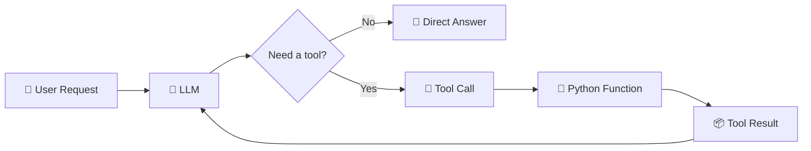
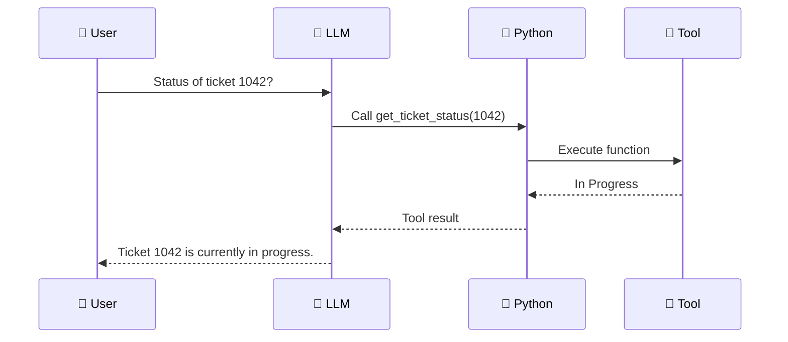

# 🔵 Week 5 — Tools and Function Calling with Python

## 🧰 From “Answering Questions” to “Using Capabilities”


> 🎯 **Big idea:** An LLM can decide *which tool is needed*, but your Python application remains responsible for executing real functions, validating inputs, handling errors, and controlling side effects.

---

## 🧭 Learning Journey



Week 4 taught students how to give an LLM access to relevant knowledge through RAG. Week 5 introduces a different capability: **tools**.

A language model can generate text, but text generation alone cannot reliably query your database, calculate a controlled business value, look up a ticket, read a sensor, or create a record in your own application.

Function calling connects LLM decisions with ordinary Python functions.

---

# 🎯 1. Learning Objectives

Students should be able to:

- explain the difference between generating text and calling a tool;
- define ordinary Python functions as tools;
- explain why tool descriptions and parameter types matter;
- inspect an LLM tool call;
- execute the selected Python function;
- return tool output to the model;
- handle multiple tools;
- validate tool arguments;
- distinguish read-only tools from side-effecting tools;
- build a small tool-using helpdesk assistant; and
- understand how tools become the foundation of agents.

---

# 🧠 2. What Problem Does Function Calling Solve?

Suppose the user asks:

```text
What is the status of ticket 1042?
```

The LLM should not invent a ticket status.

Instead:

```text
User
  │
  ▼
LLM recognizes that live data is needed
  │
  ▼
get_ticket_status(ticket_id=1042)
  │
  ▼
Python reads the ticket system
  │
  ▼
"In Progress"
  │
  ▼
LLM explains the result to the user
```


The LLM chooses *what capability to request*. Python controls *what actually happens*.

---

# 🛠 3. A Tool Is Often Just a Python Function

Start with a normal function:

```python
def get_ticket_status(ticket_id: int) -> str:
    """Return the current status of a support ticket."""

    tickets = {
        1001: "Open",
        1002: "Waiting for User",
        1042: "In Progress"
    }

    return tickets.get(ticket_id, "Ticket not found")
```

Without an LLM, we can call it directly:

```python
print(get_ticket_status(1042))
```

Result:

```text
In Progress
```

Function calling adds a decision layer:

```text
User language
    │
    ▼
LLM decides which function + arguments
    │
    ▼
Python executes function
```

---

# 🧩 4. Why Function Descriptions Matter

The model needs to understand:

```text
Tool name
Tool purpose
Required arguments
Argument types
Expected behavior
```

Good Python type hints and docstrings make the function easier to expose as a tool.

```python
def get_ticket_status(ticket_id: int) -> str:
    """Get the current status of a support ticket.

    Args:
        ticket_id: Numeric support-ticket identifier.

    Returns:
        Ticket status, or a not-found message.
    """
```

> 💡 **Teaching connection:** Function calling links ordinary Python concepts—functions, parameters, return values, dictionaries, type hints—to LLM application development.

---

# 🤖 5. Tool Calling with Ollama

Ollama currently supports tool/function calling, and its Python SDK can derive tool schemas from Python functions.

```python
from ollama import chat


def get_ticket_status(ticket_id: int) -> str:
    """Get the current status of a support ticket."""

    tickets = {
        1001: "Open",
        1002: "Waiting for User",
        1042: "In Progress"
    }

    return tickets.get(ticket_id, "Ticket not found")


messages = [
    {
        "role": "user",
        "content": "What is the status of ticket 1042?"
    }
]

response = chat(
    model="qwen3",
    messages=messages,
    tools=[get_ticket_status]
)
```

The response may contain a requested function call rather than a final natural-language answer.

---

# 🔍 6. Inspect the Tool Call

```python
if response.message.tool_calls:
    for call in response.message.tool_calls:
        print("Tool:", call.function.name)
        print("Arguments:", call.function.arguments)
```

Conceptually, the model is producing something like:

```text
Tool: get_ticket_status
Arguments: {"ticket_id": 1042}
```

Notice what has *not* happened yet:

```text
The LLM has requested the tool.
Python has not executed it yet.
```

That separation is important for security and control.

---

# ▶️ 7. Execute the Tool in Python

```python
available_functions = {
    "get_ticket_status": get_ticket_status
}

for call in response.message.tool_calls or []:
    function = available_functions[call.function.name]
    result = function(**call.function.arguments)

    print("Tool result:", result)
```

The `**` operator expands the arguments dictionary into named Python parameters.

Example:

```python
{"ticket_id": 1042}
```

becomes:

```python
get_ticket_status(ticket_id=1042)
```

---

# 🔄 8. Return the Tool Result to the LLM

The model may need the result to write a user-friendly final response.

```python
messages.append(response.message)

for call in response.message.tool_calls or []:
    function = available_functions[call.function.name]
    result = function(**call.function.arguments)

    messages.append({
        "role": "tool",
        "tool_name": call.function.name,
        "content": str(result)
    })

final_response = chat(
    model="qwen3",
    messages=messages,
    tools=[get_ticket_status]
)

print(final_response.message.content)
```

The flow is:



---

# 🧰 9. Multiple Tools

An assistant becomes more useful when several capabilities are available.

```python
def get_ticket_status(ticket_id: int) -> str:
    """Get the status of a support ticket."""
    ...


def get_device_owner(device_id: str) -> str:
    """Return the registered owner of a device."""
    ...


def calculate_storage_percent(used_gb: float, total_gb: float) -> float:
    """Calculate percentage of storage currently used."""
    return round((used_gb / total_gb) * 100, 1)
```

Expose all tools:

```python
tools = [
    get_ticket_status,
    get_device_owner,
    calculate_storage_percent
]
```

Now the LLM becomes a **router**:

```text
User Request
    │
    ▼
Which tool is appropriate?
    │
    ├── Ticket status
    ├── Device owner
    └── Storage calculation
```

---

# 🛡 10. Tool Safety and Validation


A tool can read information or change the world.

### Read-only tools

```text
get_ticket_status
search_policy
get_device_owner
calculate_value
```

### Side-effecting tools

```text
create_ticket
send_email
reset_password
cancel_order
delete_record
```

Students should learn that side-effecting tools require additional safeguards.

A safe pattern is:

```text
LLM requests action
      │
      ▼
Validate arguments
      │
      ▼
Check authorization
      │
      ▼
Ask for approval if needed
      │
      ▼
Execute
      │
      ▼
Log result
```

> ⚠️ The LLM should not be treated as the final authorization layer for sensitive actions.

---

# ✅ 11. Validate Tool Arguments

Even when a model produces structured arguments, Python should still validate them.

```python
def calculate_storage_percent(
    used_gb: float,
    total_gb: float
) -> float:

    if total_gb <= 0:
        raise ValueError("total_gb must be greater than zero")

    if used_gb < 0:
        raise ValueError("used_gb cannot be negative")

    return round((used_gb / total_gb) * 100, 1)
```

This is ordinary defensive programming.

LLMs do not replace validation.

---

# 🧠 12. OpenAI Tool Categories — Current Conceptual Map

In the current Responses API, tools can include built-in capabilities such as web/file search, MCP tools/connectors, and custom function calls that invoke your own code.

For teaching, students can use this mental model:

```text
LLM Tools
│
├── Built-in / hosted tools
│   ├── Web search
│   ├── File search
│   └── Other hosted capabilities
│
├── External integration tools
│   └── MCP / connectors
│
└── Custom function tools
    └── Your Python code
```

Week 5 focuses primarily on **custom Python functions**, because students can see and control the entire process.

---

# 🧪 13. Classroom Activity — Become the Tool Router

Give each group four paper “tools”:

```text
get_ticket_status(ticket_id)
get_room_temperature(room)
search_handbook(query)
calculate_storage_percent(used, total)
```

Read user requests aloud.

Example:

```text
My laptop uses 450 GB of a 500 GB drive. How full is it?
```

Students must choose:

```text
Tool: calculate_storage_percent
Arguments: used=450, total=500
```

Then execute the function manually.

This teaches **tool selection before code orchestration**.

---

# 🏆 14. Week 5 Main Assignment — Campus IT Tool Assistant

## Scenario

Build an assistant that can use Python tools instead of inventing operational data.

### Minimum tools

```text
get_ticket_status(ticket_id)
get_device_owner(device_id)
calculate_storage_percent(used_gb, total_gb)
```

### Requirements

Students should:

1. define at least three Python tools;
2. add type hints and clear docstrings;
3. send a user request to the LLM;
4. detect requested tool calls;
5. execute the correct function;
6. return tool results to the model;
7. generate the final response;
8. handle an unknown tool safely;
9. handle invalid arguments; and
10. record which tool was used.

### Suggested test prompts

```text
What is the status of ticket 1042?
Who owns device PC-27?
450 GB of my 500 GB disk is used. What percentage is full?
Tell me a joke about Python.
```

The last question should test whether the assistant can answer **without** a tool.

---

# 📊 15. Tool Evaluation Table

| Test | Correct tool? | Correct arguments? | Correct result? | Final response correct? |
|---|---:|---:|---:|---:|
| Ticket lookup | ✅/❌ | ✅/❌ | ✅/❌ | ✅/❌ |
| Device lookup | ✅/❌ | ✅/❌ | ✅/❌ | ✅/❌ |
| Calculation | ✅/❌ | ✅/❌ | ✅/❌ | ✅/❌ |
| No-tool question | N/A | N/A | N/A | ✅/❌ |

---

# ⚠️ 16. Common Mistakes

### The model invents operational data

Fix: require the relevant tool for data that must come from the system.

### Tool descriptions are vague

Fix: explain exactly when a tool should be used.

### Python blindly trusts arguments

Fix: validate ranges and types.

### Every tool can change data

Fix: start with read-only tools and add explicit approval for write actions.

### No error path exists

Fix: tools should return understandable errors and the application should handle failures.

---

# ⏰ 17. Suggested Three-Hour Lesson

| Time | Activity |
|---|---|
| 00:00–00:20 | Why LLMs need tools |
| 00:20–00:45 | Python functions as capabilities |
| 00:45–01:10 | Single function call |
| 01:10–01:30 | Returning tool results |
| 01:30–01:45 | Break |
| 01:45–02:10 | Multiple tools and routing |
| 02:10–02:30 | Validation and side effects |
| 02:30–02:50 | Campus IT assistant lab |
| 02:50–03:00 | Week 6 preview |

---

# ➡️ 18. Connection to Week 6

A tool-enabled assistant may make **one** decision:

```text
Question → Tool → Answer
```

An agent can repeat this process:

```text
Goal
  ↓
Decide
  ↓
Use Tool
  ↓
Observe Result
  ↓
Decide Again
  ↓
Stop When Goal Is Complete
```

That loop is the bridge to **Simple AI Agents**.

---

# 🔗 Official References

- Ollama Tool Calling: https://docs.ollama.com/capabilities/tool-calling
- OpenAI Responses API: https://developers.openai.com/api/reference/cli/resources/responses/methods/create
- OpenAI Current Model / Tool Guidance: https://developers.openai.com/api/docs/guides/latest-model

> 🎓 **Final Week 5 message:** Function calling does not give an LLM unlimited power. It gives the model a controlled menu of capabilities, while your Python application decides how those capabilities are executed and protected.
