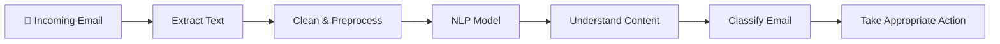
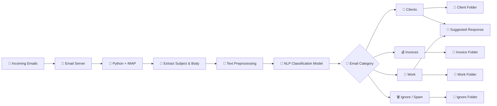
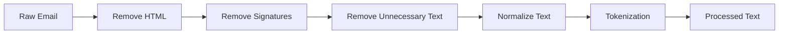
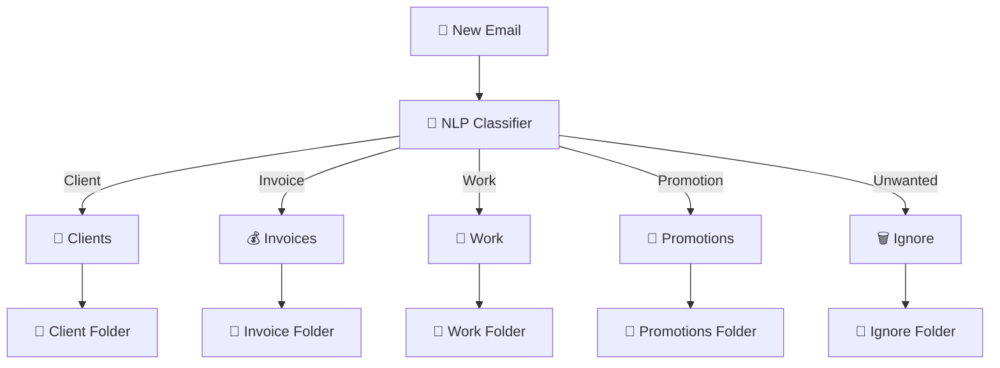
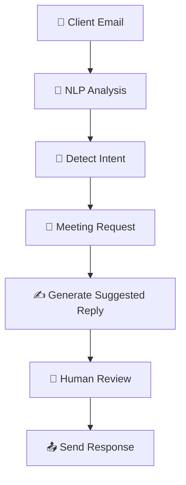
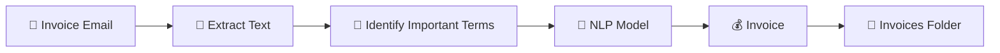
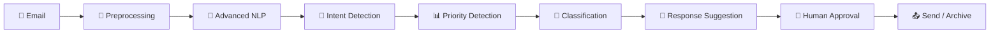
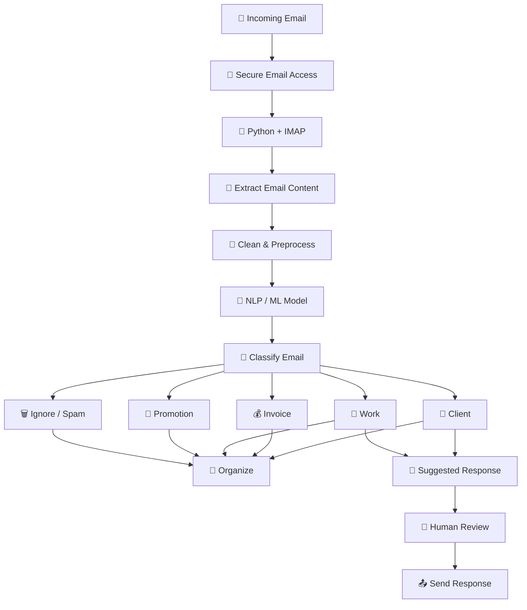

# 📧 Automating Email Sorting and Responses with NLP

> **Assignment Topic:** Natural Language Processing and Email Automation
> **Technology:** Python, IMAP, NLP, Machine Learning
> **Application Area:** Email Management and Automation

---

## 📑 Table of Contents

* [1. Introduction](#1-introduction)
* [2. Problem Statement](#2-problem-statement)
* [3. Proposed Solution](#3-proposed-solution)
* [4. How the System Works](#4-how-the-system-works)
* [5. Technologies Used](#5-technologies-used)
* [6. Email Classification Example](#6-email-classification-example)
* [7. Automated Responses](#7-automated-responses)
* [8. Advantages](#8-advantages)
* [9. Challenges and Limitations](#9-challenges-and-limitations)
* [10. Future Improvements](#10-future-improvements)
* [11. Conclusion](#11-conclusion)
* [12. References](#12-references)

---

# 1. Introduction

Email has become an essential communication tool for students, employees, organizations, and businesses. However, managing a large number of emails every day can be time-consuming.

A user may receive emails from clients, colleagues, financial departments, online services, advertisements, and many other sources. Important messages can easily be missed when an inbox becomes crowded.

**Natural Language Processing (NLP)** can help solve this problem. NLP allows computers to process and analyze human language. In an email automation system, NLP can be used to understand the subject and content of incoming messages and classify them into predefined categories.

For example, an email containing the words **invoice**, **payment**, or **billing** could be classified as an **Invoice** email, while a message asking about a meeting could be classified as a **Client** or **Work** email.

Text classification is a common NLP application used for tasks such as spam filtering, topic classification, sentiment analysis, and intent detection.

### 🧠 NLP Workflow



---

# 2. Problem Statement

Sorting emails manually takes a significant amount of time.

For example, a person may receive:

* 📩 Client messages
* 💰 Invoices
* 💼 Work-related emails
* 📅 Meeting notifications
* 📢 Advertisements
* 🚨 Important alerts
* 🗑️ Unwanted or spam messages

Checking every email manually and moving it to the correct folder is inefficient.

### Main Problem

> **How can NLP and Python be used to automatically read, classify, organize, and respond to incoming emails?**

An automated email management system can reduce manual work by analyzing incoming messages and automatically deciding what should happen to each email.

---

# 3. Proposed Solution

The proposed solution is a **Python-based email automation system** that combines **IMAP** with **Natural Language Processing**.

The system connects to an email account using IMAP, retrieves incoming messages, extracts their content, and sends the text to an NLP classification model.

The model then determines the category of each email.

## 📊 Overall System Architecture



---

# 4. How the System Works

The system can be divided into six major stages.

## Step 1: Access the Email Account

Python connects to the user's email server using **IMAP**.

The connection allows the program to retrieve incoming messages without requiring the user to manually open and inspect every email.

For secure implementations, modern authentication should be preferred rather than storing an email password directly in the program.

---

## Step 2: Read Incoming Messages

After connecting to the email account, the program searches for new or unread messages.

It can extract information such as:

* Sender
* Recipient
* Subject
* Email body
* Date and time
* Attachments
* Message ID

The subject and body are especially useful for NLP-based classification.

---

## Step 3: Clean and Process the Text

Email messages often contain unnecessary content such as signatures, reply histories, HTML tags, disclaimers, and formatting characters.

Therefore, the text should be cleaned before it is given to the NLP model.

### 🧹 Text Processing Pipeline



---

## Step 4: Classify the Email

The processed email is given to an NLP or machine-learning model.

The model predicts which category best matches the message.

### 📂 Example Categories

| Category          | Example Keywords               | Example Email                              |
| ----------------- | ------------------------------ | ------------------------------------------ |
| 👥 **Clients**    | meeting, customer, request     | "Can we schedule a meeting?"               |
| 💰 **Invoices**   | invoice, payment, billing      | "Please find the August invoice attached." |
| 💼 **Work**       | project, report, task          | "Please review the project report."        |
| 📢 **Promotions** | offer, discount, sale          | "Get 30% off this weekend!"                |
| 🗑️ **Ignore**    | prize, advertisement, unwanted | "Congratulations! You have won!"           |

---

## Step 5: Organize the Inbox

Once the email has been classified, the system can automatically move it to the appropriate folder.

### 📂 Automated Folder Organization



---

## Step 6: Generate Responses

The system can also assist with email responses.

For example, a client asking about meeting availability could receive an automatically generated acknowledgment.



For important or sensitive messages, human review should be included before an automated response is sent.

---

# 5. Technologies Used

## 🐍 Python

Python is used as the main programming language.

It can handle:

* Email connections
* Text processing
* Machine-learning models
* NLP operations
* Folder organization
* Automated responses

---

## 📬 IMAP

**IMAP stands for Internet Message Access Protocol.**

It is used to access email messages stored on a mail server.

The application can use IMAP to:

1. Connect to the email server.
2. Authenticate the user.
3. Select an inbox.
4. Search for messages.
5. Retrieve email content.
6. Process the messages.

---

## 🧠 Natural Language Processing

NLP allows the computer to analyze human language.

In this project, NLP can be used to:

* Identify important words.
* Understand the topic of an email.
* Detect intent.
* Classify messages.
* Identify spam.
* Assist in generating responses.

---

## 🤖 Machine Learning

A machine-learning classifier can be trained using examples of previously categorized emails.

For example:

```text
Email 1 → Invoice
Email 2 → Client
Email 3 → Work
Email 4 → Spam
Email 5 → Invoice
```

After training, the model can classify new emails.

---

# 6. Email Classification Example

Consider the following email:

### 📧 Example Email

**Subject:** Invoice for August

**Message:**

> Please find attached the invoice for the services provided during August. Kindly confirm receipt of the invoice.

### 🔎 NLP Analysis

The system identifies important terms such as:

```text
invoice
services
August
confirm receipt
```

The classifier determines that the email belongs to the:

> 💰 **Invoice Category**

The system then moves the message to:

```text
📁 Inbox
   └── 💰 Invoices
```

### Classification Flow



---

# 7. Automated Responses

Suppose a client sends:

### 📧 Client Email

**Subject:** Meeting Request

> Can we schedule a meeting for tomorrow?

The NLP system identifies the intent as a **meeting request**.

It could prepare a response such as:

> **Thank you for your message. I have received your meeting request and will confirm the available time shortly.**

### 🤖 Automated Response Workflow


---

# 8. Advantages

An NLP-based email automation system provides several benefits.

## ⏱️ 1. Saves Time

The system can process many emails automatically instead of requiring a person to sort each message manually.

## 📂 2. Improves Organization

Emails can automatically be placed into appropriate folders.

## 🎯 3. Reduces Missed Messages

Important emails can be identified and prioritized.

## 🚀 4. Increases Productivity

Users can spend more time on important tasks rather than repetitive inbox management.

## 🤖 5. Faster Responses

Common questions can receive suggested or automated responses.

## 🔄 6. Continuous Processing

The system can be configured to process new messages regularly.

---

# 9. Challenges and Limitations

Although email automation has many advantages, it also has limitations.

## ⚠️ 1. Incorrect Classification

An NLP model may misunderstand an email or place it in the wrong category.

For example, an email could contain both an invoice and a client request.

---

## ⚠️ 2. Ambiguous Language

Human language can be difficult for computers to understand.

The same word may have different meanings depending on context.

---

## ⚠️ 3. Privacy and Security

Email messages may contain confidential or personal information.

The system must therefore use:

* Secure authentication
* Appropriate access controls
* Encryption where appropriate
* Careful handling of email data
* Limited access to sensitive information

---

## ⚠️ 4. Training Data

A machine-learning model needs suitable training data.

Poor-quality or unbalanced training data can reduce classification accuracy.

---

## ⚠️ 5. Automated Responses

Automatically sending responses can sometimes produce inappropriate or incorrect messages.

For important communications, a human approval step is recommended.

---

# 10. Future Improvements

The project can be improved by adding more advanced features.

### 🚀 Possible Improvements

* 🧠 More accurate NLP models
* 📊 Machine-learning performance monitoring
* 🛡️ Improved spam detection
* ⭐ Email priority scoring
* 😊 Sentiment analysis
* 🌍 Multilingual email processing
* 🤖 Smarter response generation
* 📎 Attachment classification
* 🔍 Important-information extraction
* 👤 Human approval before sending responses
* 📈 Learning from user corrections

### Future System Architecture



---

# 11. Conclusion

Automating email sorting and responses with NLP is a practical application of **Artificial Intelligence, Natural Language Processing, and Machine Learning**.

By combining Python, IMAP, text preprocessing, and an NLP classification model, an email automation system can:

* 📧 Read incoming emails
* 🧹 Clean email content
* 🧠 Understand the text
* 🎯 Classify messages
* 📂 Organize emails
* ⭐ Identify important messages
* 🤖 Suggest responses
* 📤 Assist with sending replies

The system can significantly reduce the amount of time users spend manually organizing their inboxes.

However, accuracy, privacy, security, and human oversight must be considered when designing the system.

Overall, NLP-based email automation demonstrates how artificial intelligence can be used to solve a common real-world problem and improve productivity.

---

# 12. Project Workflow

The complete project can be summarized as follows:



---

# 📌 Recommended Visuals

For a polished GitHub project or academic submission, the following visuals can be used:

| Section             | Visual                            |
| ------------------- | --------------------------------- |
| Introduction        | 🧠 NLP Workflow                   |
| Proposed Solution   | 📧 Email Automation Architecture  |
| Text Processing     | 🧹 Email Preprocessing Pipeline   |
| Classification      | 🎯 Email Classification Flowchart |
| Inbox Organization  | 📂 Automatic Folder Sorting       |
| Automated Responses | 🤖 Response Generation Workflow   |
| Future Improvements | 🚀 Advanced AI Email Assistant    |

The Mermaid diagrams above are **GitHub-compatible** and can be rendered directly by GitHub in Markdown files.

---

# 📚 References

1. **Google for Developers — Text Classification**
   https://developers.google.com/machine-learning/guides/text-classification

2. **Google for Developers — IMAP, POP, and SMTP**
   https://developers.google.com/workspace/gmail/imap/imap-smtp

3. **IBM — Text Classification**
   https://www.ibm.com/think/topics/text-classification

4. **IBM — Parsing Emails**
   https://www.ibm.com/docs/en/SSWTQQ_2.0.3/solnguide/c_si_parsingemails.html

5. **IBM — Sample Classification Workflow**
   https://www.ibm.com/docs/en/contentclassificatio/8.8.0?topic=overview-sample-classification-workflow

---

## ⭐ Final Outcome

> **A smart email assistant that automatically reads, understands, classifies, organizes, and assists with responding to incoming emails.**

---

### 📁 Suggested GitHub Repository Structure

```text
email-nlp-automation/
│
├── README.md
├── requirements.txt
├── main.py
│
├── src/
│   ├── email_reader.py
│   ├── email_classifier.py
│   ├── text_processor.py
│   └── response_generator.py
│
├── models/
│   └── email_classifier.pkl
│
├── data/
│   └── training_data.csv
│
├── images/
│   ├── nlp-workflow.png
│   ├── email-classification.png
│   └── email-automation.png
│
└── docs/
    └── assignment.md
```

> **Note:** GitHub renders Mermaid diagrams in `.md` files, so no external image files are required for the diagrams included above.
