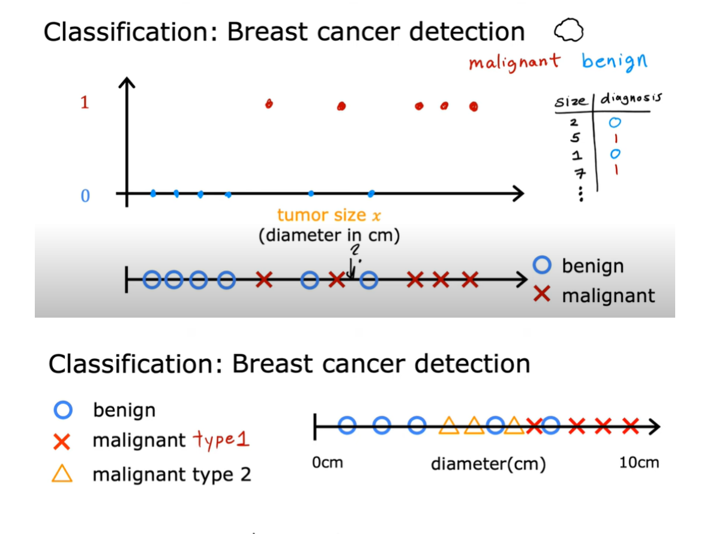

# 🎯 Classification: Breast Cancer Detection

> **Topic:** Supervised Machine Learning  
> **Learning Type:** Classification  
> **Example:** Benign vs. Malignant Tumor Classification  
> **Important:** This is a simplified educational example.

---

## Original Visual



---

# 1. What is the Main Concept?

The picture explains **classification in supervised Machine Learning** using a simplified breast-cancer example.

The goal is to predict a **category**, rather than a continuous number.

```text
Tumor
  │
  ▼
Benign or Malignant?
```

This is called **binary classification** because the model has two possible output classes:

```text
0 = Benign
1 = Malignant
```

---

# 2. What Does the X-Axis Represent?

The horizontal axis represents:

```text
Tumor size / diameter in cm
```

For example:

```text
Small tumor ─────────────────────► Large tumor
```

Each point represents one historical patient or tumor sample.

In the diagram:

```text
○ Blue = Benign
× Red  = Malignant
```

The model may receive training examples such as:

| Tumor Size | Diagnosis |
|---:|---|
| 2 cm | Benign |
| 5 cm | Malignant |
| 1 cm | Benign |
| 7 cm | Malignant |

This is **supervised learning** because the correct diagnosis is already known during model training.

---

# 3. How Does the Model Learn?

The model studies the relationship between the input and the known output.

```text
INPUT
Tumor Size
     │
     ▼
Machine Learning Model
     │
     ▼
OUTPUT
Benign / Malignant
```

Example:

```text
Training Data

2 cm  → Benign
3 cm  → Benign
4 cm  → Benign
6 cm  → Malignant
8 cm  → Malignant
9 cm  → Malignant
        │
        ▼
Model learns a pattern
        │
        ▼
New tumor = 7 cm
        │
        ▼
Prediction = Malignant
```

---

# 4. Why Are Some Points Mixed?

The middle part of the image shows that benign and malignant examples are **not perfectly separated**.

```text
○ ○ ○ ○   ×   ○   ×   ○   × × ×
```

This means that **tumor size alone cannot perfectly classify every sample**.

For example:

```text
5 cm   → could be benign
5.5 cm → could be malignant
```

A classifier therefore needs to learn a **decision boundary**.

```text
Tumor size
0 cm                                10 cm
 │                                    │
 ○ ○ ○ ○ ○        |       × × × × ×
                   ↑
            Decision boundary
```

A simplified interpretation could be:

```text
Left side  → predict Benign

Right side → predict Malignant
```

Because the classes overlap, some predictions may still be incorrect.

---

# 5. Binary Classification

The top and middle parts of the image demonstrate **binary classification**.

```text
                    Tumor
                      │
                      ▼
               Classification
                      │
               ┌──────┴──────┐
               ▼             ▼
           Benign         Malignant
             0                1
```

Binary classification means that the target has **two possible classes**.

Other examples include:

```text
Spam / Not Spam

Fraud / Not Fraud

Pass / Fail

Attack / Normal
```

---

# 6. Multi-Class Classification

The bottom part expands the same idea to **three classes**.

```text
○ = Benign

× = Malignant Type 1

△ = Malignant Type 2
```

The model must now predict one of several categories:

```text
             Tumor
               │
               ▼
        Classification
               │
       ┌───────┼───────────┐
       ▼       ▼           ▼
    Benign  Malignant   Malignant
              Type 1      Type 2
```

This is called **multi-class classification**.

---

# 7. Binary vs. Multi-Class Classification

| Type | Example | Number of Classes |
|---|---|---:|
| **Binary Classification** | Benign vs. Malignant | 2 |
| **Multi-Class Classification** | Benign, Malignant Type 1, Malignant Type 2 | 3 or more |

Visual comparison:

```text
BINARY

Input
  │
  ▼
Model
  │
 ┌┴┐
 ▼ ▼
 0 1
```

```text
MULTI-CLASS

Input
  │
  ▼
Model
  │
 ┌┼┐
 ▼▼▼
 A B C
```

---

# 8. Why Is This Supervised Learning?

The training data already contain the correct diagnosis.

```text
Tumor Size + Known Diagnosis
          │
          ▼
       Training
          │
          ▼
Model learns relationship
          │
          ▼
New Tumor Size
          │
          ▼
Predicted Diagnosis
```

In Machine Learning notation:

```text
X = Tumor size or other input features

y = Known diagnosis
```

For example:

```python
X = tumor_size
y = diagnosis
```

The model learns from the known `X → y` examples and then tries to predict `y` for new observations.

---

# 9. Important Real-World Limitation

This picture is a **simplified teaching example**.

Real breast-cancer diagnosis is **not based only on tumor diameter**.

A real clinical assessment may use many types of information, such as:

- Medical imaging
- Pathology
- Cellular characteristics
- Biomarkers
- Patient history
- Other clinical findings

Therefore, the image should be understood as a way to teach the basic Machine Learning idea:

> **A classification algorithm learns from labeled examples and predicts which predefined category a new observation belongs to.**

---

# 10. Final Summary

```text
Tumor Characteristics
        │
        ▼
Supervised ML Classification
        │
        ▼
Predict a Category
        │
   ┌────┴─────┐
   ▼          ▼
Benign     Malignant
```

The bottom part extends the same concept from:

```text
Two Classes
     │
     ▼
Binary Classification
```

to:

```text
Three or More Classes
        │
        ▼
Multi-Class Classification
```

---

# ✅ Key Takeaway

> **Classification is a supervised Machine Learning task in which the model learns from labeled examples and predicts a category for new data.**
