# 🌈 Week 2 — Prompt Engineering with Python

## 🚀 From Simple Questions to Reliable AI Instructions

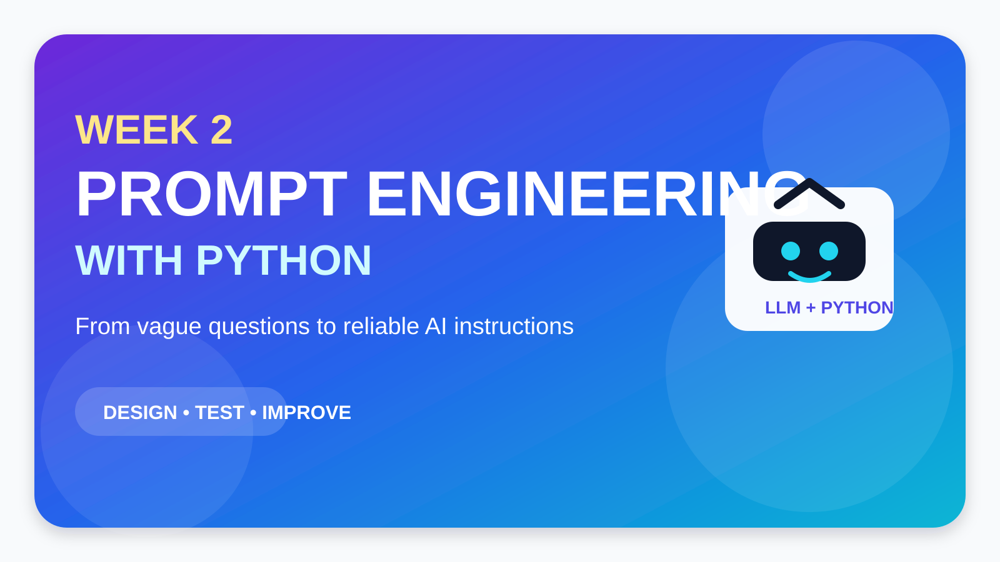

> 🎯 **Big idea:** A prompt is not simply a question. In an LLM application, a prompt is part of the software design.

---

## 🧭 Learning Journey

```mermaid
%%{init: {"theme":"base","themeVariables":{
  "primaryColor":"#ede9fe",
  "primaryTextColor":"#312e81",
  "primaryBorderColor":"#7c3aed",
  "lineColor":"#64748b",
  "secondaryColor":"#dbeafe",
  "tertiaryColor":"#dcfce7"
}}}%%
flowchart LR
    A["😕 Vague Prompt"] --> B["🎯 Define Goal"]
    B --> C["🧠 Add Context"]
    C --> D["📏 Add Constraints"]
    D --> E["🧩 Define Output"]
    E --> F["🧪 Test"]
    F --> G["📊 Evaluate"]
    G --> H["🔁 Improve"]
```

Large Language Models (LLMs) such as GPT, Llama, Gemma, Claude, Gemini, and Mistral can generate explanations, summaries, code, classifications, recommendations, and many other forms of text. However, the model does not automatically know exactly what we need.

In **Week 1**, we learned the basic relationship:

```text
User
  │
  ▼
Python Program
  │
  ▼
Prompt
  │
  ▼
Large Language Model
  │
  ▼
Generated Response
```

In **Week 2**, we move from simply *using* an LLM to *engineering* its instructions.

> 💡 **Central question:** How can we design prompts so that an LLM produces useful, relevant, consistent, and application-friendly responses?

---

# 🎯 1. Learning Objectives

After completing this lesson, students should be able to:

- ✅ explain what prompt engineering means;
- ✅ distinguish between weak and well-structured prompts;
- ✅ identify the main components of a prompt;
- ✅ use role, task, context, constraints, and output formatting;
- ✅ understand zero-shot, one-shot, and few-shot prompting;
- ✅ create reusable prompt templates in Python;
- ✅ insert Python variables using f-strings;
- ✅ separate application instructions from user input;
- ✅ version and test prompts;
- ✅ evaluate LLM outputs systematically; and
- ✅ build an AI Helpdesk Ticket Classifier.

---

# 🧠 2. What Is Prompt Engineering?

> **Prompt engineering is the process of designing, testing, evaluating, and improving instructions given to a Large Language Model.**

A simple prompt may look like this:

```text
Explain Python.
```

The model can answer, but the prompt leaves many decisions open:

- Who is the audience?
- How much detail is needed?
- Should the answer include code?
- Should it contain exercises?
- What language level should be used?
- What format should the model follow?

A stronger prompt is:

```text
Explain Python variables to a first-semester IT student
who has no previous programming experience.

Requirements:

- Use simple language.
- Start with a short definition.
- Give one everyday analogy.
- Give one executable Python example.
- Explain the code.
- Finish with two exercises.
- Do not provide the solutions.
- Keep the answer below 300 words.
```

### 🔴 Weak Prompt vs 🟢 Strong Prompt

| Weak Prompt | Strong Prompt |
|---|---|
| `Explain Python.` | Defines audience, task, requirements, and structure |
| Vague | Specific |
| Model decides most details | Developer controls important details |
| Harder to evaluate | Easier to evaluate |

```text
Vague Prompt
     │
     ▼
More freedom for the model
     │
     ▼
Less predictable output


Clear Prompt
     │
     ▼
More useful guidance
     │
     ▼
More controlled output
```

---

# 🔁 3. Prompt Engineering Is an Iterative Process

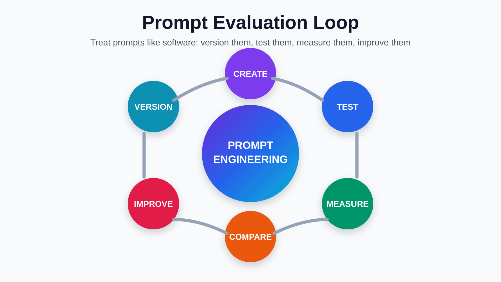

Prompt engineering works like software development:

```text
Design → Implement → Test → Find Problems → Improve → Test Again
```

A prompt should rarely be considered finished after one test.

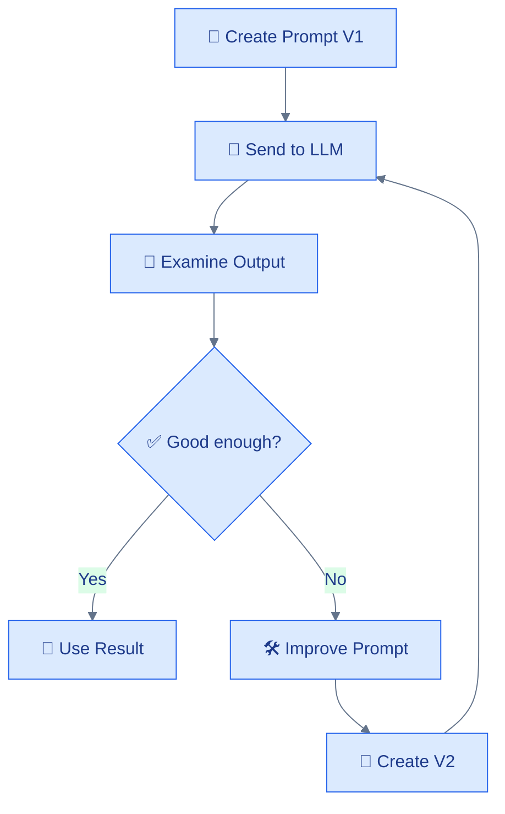

---

# 🧩 4. Anatomy of a Strong Prompt

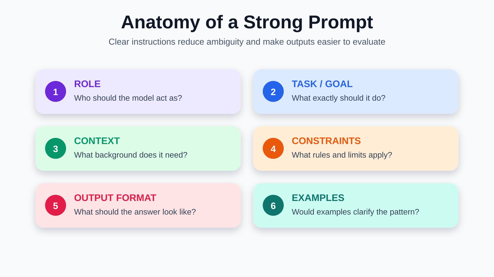

A useful framework is:

```text
ROLE
   ↓
TASK / GOAL
   ↓
CONTEXT
   ↓
CONSTRAINTS
   ↓
OUTPUT FORMAT
   ↓
EXAMPLES
   ↓
SUCCESS CRITERIA
```

> 🟣 **Important:** Not every prompt needs every component. Add information because it improves the task—not simply because it makes the prompt longer.

---

# 👨‍🏫 5. Technique 1 — Role Prompting

A role tells the model what function or perspective it should adopt.

```text
You are an experienced Python programming instructor.
```

Other examples:

```text
You are an IT helpdesk support assistant.
```

```text
You are a cybersecurity analyst.
```

```text
You are a software testing assistant.
```

### ❌ Weak

```text
Explain functions.
```

### ✅ Improved

```text
You are a Python programming instructor.

Explain Python functions to a beginner.
```

But remember:

> ⚠️ **Role alone does not make a prompt strong.**

This is still vague:

```text
You are the greatest Python expert in the world.

Explain Python.
```

A clear goal and useful context are normally more valuable than exaggerated role language.

---

# 🎯 6. Technique 2 — Define the Task or Goal

The task answers:

> **What exactly should the model do?**

Compare:

```text
Python lists.
```

with:

```text
Explain Python lists.
```

and then:

```text
Explain Python lists to a beginner who understands variables
but has never worked with collections.
```

Useful task verbs include:

| Task Type | Example |
|---|---|
| 📘 Explain | Explain Python functions |
| 📝 Summarize | Summarize an article |
| 🗂 Classify | Classify a helpdesk ticket |
| 🔎 Extract | Extract email addresses |
| ⚖️ Compare | Compare lists and tuples |
| 🌍 Translate | Translate a support message |
| 🧪 Evaluate | Evaluate the quality of an answer |
| 🛠 Generate | Generate three exercises |

---

# 🧠 7. Technique 3 — Add Context

Context tells the model what it needs to know.

Without context:

```text
Explain inheritance.
```

With context:

```text
The students already understand Python classes and objects.

They have not studied inheritance.

Explain inheritance at their current programming level.
```

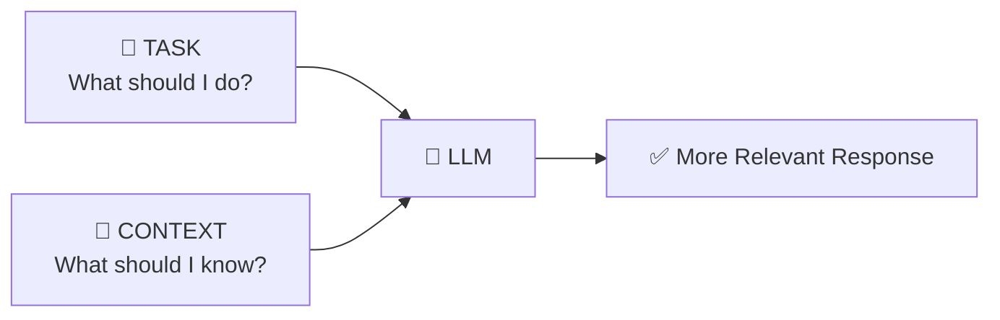

Useful context can include:

- 🎓 student level;
- 📚 previous knowledge;
- 👤 customer information;
- 🏢 company rules;
- 📄 document content;
- 💻 application state; or
- 💬 earlier conversation.

---

# 📏 8. Technique 4 — Add Constraints

Constraints define rules and boundaries.

```text
Requirements:

- Use beginner-friendly language.
- Maximum 250 words.
- Give one real-world analogy.
- Include one executable Python example.
- Avoid advanced Python concepts.
```

Constraints may control:

- 📐 length;
- 🌐 language;
- 🎓 complexity;
- 🔢 number of examples;
- 🗂 allowed categories;
- 🎭 tone;
- 🧩 formatting; or
- 🚫 prohibited content.

> ✅ Good constraints make success easier to measure.

---

# 🧱 9. Technique 5 — Define the Output Format

For a human, free text may be fine.

For Python, predictable structure is much more useful.

### ❌ Unstructured

```text
Analyze this support request.
```

### ✅ Structured

```text
Analyze the following support request.

Return:

Category:
Priority:
Summary:
Recommended Action:
```

Example input:

```text
My computer crashes whenever I start Visual Studio.
I have an examination tomorrow.
```

Possible output:

```text
Category: Technical

Priority: High

Summary:
Computer crashes when Visual Studio starts.

Recommended Action:
Investigate application logs, system resources,
drivers, and the Visual Studio installation.
```

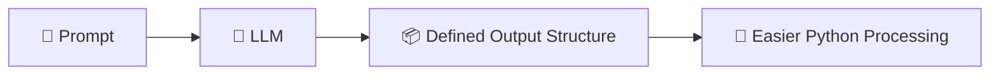

---

# 🎲 10. Zero-Shot, One-Shot and Few-Shot Prompting

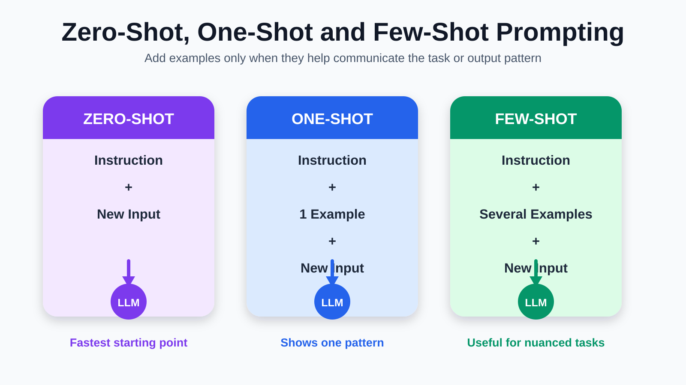

## 🟣 Zero-Shot Prompting

No examples are provided.

```text
Classify the following customer support message
into exactly one category:

Billing
Technical
Returns
General

Message:
"My WiFi connection keeps disconnecting."

Return only the category.
```

Possible result:

```text
Technical
```

---

## 🔵 One-Shot Prompting

One example is provided.

```text
Classify customer messages as:

Billing
Technical
Returns
General

Example:

Message:
"My credit card was charged twice."

Category:
Billing

Now classify:

Message:
"My computer will not start."

Category:
```

Possible result:

```text
Technical
```

---

## 🟢 Few-Shot Prompting

Several examples are provided.

```text
Classify customer messages into:

Billing
Technical
Returns
General

Example 1:
Message: "I was charged twice."
Category: Billing

Example 2:
Message: "My application crashes."
Category: Technical

Example 3:
Message: "I want to return my order."
Category: Returns

Example 4:
Message: "What time does customer service open?"
Category: General

Now classify:

Message:
"My internet keeps disconnecting."

Category:
```

Possible result:

```text
Technical
```

### ⚖️ Comparison

| Technique | Examples | Strength | Limitation |
|---|---:|---|---|
| 🟣 Zero-shot | 0 | Short and simple | Can struggle with ambiguity |
| 🔵 One-shot | 1 | Shows one pattern | Limited coverage |
| 🟢 Few-shot | Several | Shows several patterns | Longer prompt |

> 💡 **Few-shot is not automatically better. Test all reasonable approaches.**

---

# 🐍 11. Prompt Templates in Python

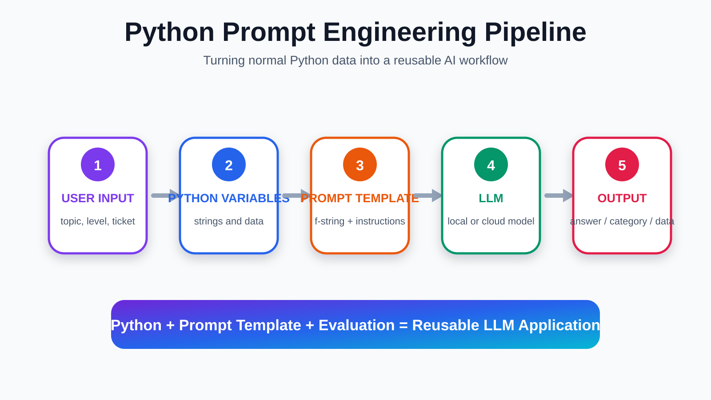

Python allows us to transform static prompts into reusable templates.

```python
topic = "Python loops"

prompt = f"""
Explain {topic} to a beginner.
"""

print(prompt)
```

The `f` creates a Python **f-string**.

The value:

```python
topic
```

is inserted into:

```python
{topic}
```

The final prompt becomes:

```text
Explain Python loops to a beginner.
```

---

# 🧰 12. Creating a Structured Prompt Template

```python
topic = input("Enter programming topic: ")
level = input("Enter student level: ")

prompt = f"""
ROLE:
You are an experienced Python programming instructor.

TASK:
Teach the following programming topic:

{topic}

CONTEXT:
Student level:

{level}

REQUIREMENTS:
- Use simple language.
- Give one everyday analogy.
- Include one executable Python example.
- Explain the example.
- Give two exercises.

OUTPUT FORMAT:
1. Definition
2. Analogy
3. Python Example
4. Explanation
5. Exercises
"""

print(prompt)
```

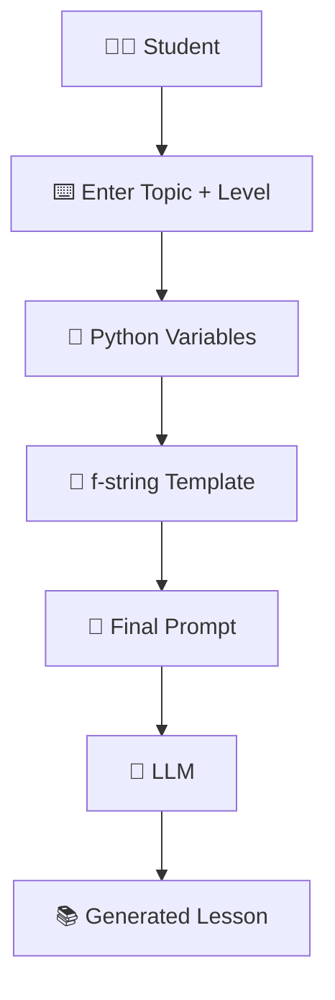

---

# ♻️ 13. Reusable Prompt Functions

A better software design is to place the template inside a function.

```python
def create_prompt(topic, level):

    prompt = f"""
    ROLE:
    You are an experienced Python programming instructor.

    TASK:
    Explain {topic}.

    CONTEXT:
    Student level: {level}

    REQUIREMENTS:
    - Use simple language.
    - Give one real-world analogy.
    - Give one executable Python example.
    - Explain the example.
    - Give two exercises.

    OUTPUT FORMAT:
    1. Definition
    2. Analogy
    3. Python Example
    4. Explanation
    5. Exercises
    """

    return prompt
```

Use it:

```python
my_prompt = create_prompt(
    "Python functions",
    "Beginner"
)

print(my_prompt)
```

```text
Prompt Engineering
        +
Python Functions
        │
        ▼
Reusable Prompt Templates
```

---

# 🤖 14. Connecting the Prompt to a Local LLM

Using Ollama:

```python
from ollama import chat


def create_prompt(topic, level):

    return f"""
    You are a Python programming instructor.

    Goal:
    Teach {topic} to a {level} student.

    Requirements:
    - Give a simple definition.
    - Give one real-world analogy.
    - Give one executable Python example.
    - Explain the example.
    - Finish with two exercises.

    Output Format:
    Definition
    Analogy
    Code
    Explanation
    Exercises
    """


topic = input("Topic: ")
level = input("Level: ")

prompt = create_prompt(topic, level)

response = chat(
    model="gemma3",
    messages=[
        {
            "role": "user",
            "content": prompt
        }
    ]
)

print(response.message.content)
```

---

# 🧭 15. Separate Application Instructions from User Input

```python
system_instruction = """
You are a programming instructor.

Your goal is to produce beginner-friendly
programming explanations.
"""
```

Then:

```python
user_question = """
Explain Python dictionaries.

Include:

- definition
- analogy
- example
- exercise
"""
```

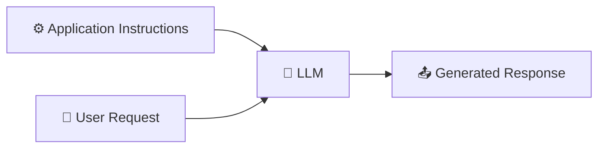

This is easier to maintain than placing everything into one uncontrolled string.

---

# ⚠️ 16. More Words Do Not Automatically Mean Better Prompts

### ❌ Noise

```text
YOU ARE THE WORLD'S GREATEST SUPPORT EXPERT.

THIS IS EXTREMELY IMPORTANT.

YOU ABSOLUTELY MUST FOLLOW EVERY INSTRUCTION.
```

### ✅ Clear

```text
Classify the support ticket.

Allowed categories:

Billing
Technical
Returns
General

Return only one category name.

Ticket:
{ticket}
```

```text
More Words
    ≠
Better Prompt
```

A stronger mental model is:

```text
Clear Goal
    +
Useful Context
    +
Relevant Constraints
    +
Defined Output
    =
Stronger Prompt
```

---

# 🧪 17. Prompt Versioning

Treat prompts like code.

### 🔴 Version 1

```python
prompt_v1 = """
Classify this support ticket.
"""
```

### 🟠 Version 2

```python
prompt_v2 = """
Classify this support ticket as:

Billing
Technical
Returns
General
"""
```

### 🟢 Version 3

```python
prompt_v3 = """
Classify the support ticket into exactly one category:

Billing
Technical
Returns
General

Return only the category name.

Ticket:
{ticket}
"""
```

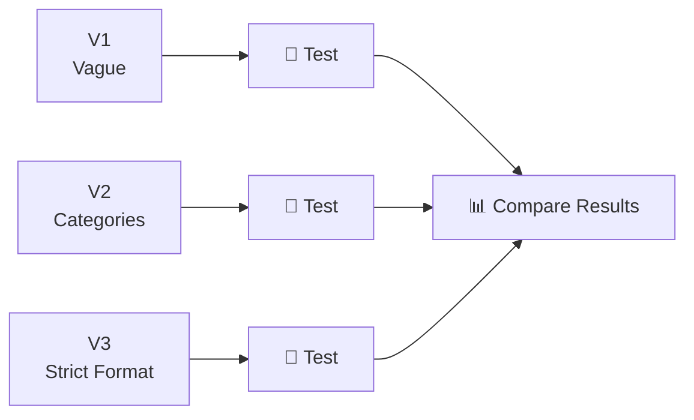

---

# 📊 18. Prompt Evaluation

A prompt should not be judged from one impressive response.

We need criteria.

| Criterion | Question |
|---|---|
| 🎯 Accuracy | Did the model select the correct answer? |
| 🧱 Format | Did it follow the requested structure? |
| 🔁 Consistency | Does it work across many inputs? |
| 🧠 Clarity | Are the instructions understandable? |
| ⚡ Efficiency | Is the prompt unnecessarily long? |

---

# 🧪 19. Creating Test Data in Python

```python
test_cases = [
    {
        "message": "My software keeps crashing.",
        "expected": "Technical"
    },
    {
        "message": "I was charged twice.",
        "expected": "Billing"
    },
    {
        "message": "I want to return this item.",
        "expected": "Returns"
    },
    {
        "message": "What time are you open?",
        "expected": "General"
    }
]
```

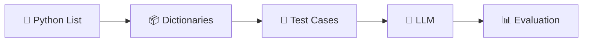

---

# 🛠 20. Building the Ticket Classifier

```python
def create_classifier_prompt(message):

    return f"""
    Classify the customer support message
    into exactly one category:

    Billing
    Technical
    Returns
    General

    Return only the category name.

    Customer message:
    {message}
    """
```

Then:

```python
from ollama import chat


def classify_ticket(message):

    prompt = create_classifier_prompt(message)

    response = chat(
        model="gemma3",
        messages=[
            {
                "role": "user",
                "content": prompt
            }
        ]
    )

    return response.message.content.strip()
```

---

# 📈 21. Automatically Testing the Prompt

```python
correct = 0

for test in test_cases:

    result = classify_ticket(test["message"])

    print("Message:", test["message"])
    print("Expected:", test["expected"])
    print("LLM:", result)

    if result == test["expected"]:
        correct += 1

    print("----------------------")


accuracy = correct / len(test_cases) * 100

print("Accuracy:", accuracy, "%")
```

The workflow is now:

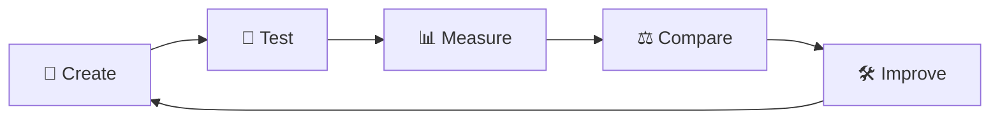

> 🚀 At this point, students are no longer simply chatting with AI. They are **engineering and evaluating an AI component**.

---

# 🏆 22. Classroom Activity — Prompt Engineering Competition

All groups receive the same ticket classification task.

### Categories

```text
Billing
Technical
Returns
General
```

### Test Messages

```text
1. "The application crashes after login."

2. "Why have you charged me €59?"

3. "Can I return this product?"

4. "Where is your Copenhagen office?"

5. "My subscription disappeared after payment."
```

### Group Challenge

| Group | Technique |
|---|---|
| 🟣 Group A | Zero-shot |
| 🔵 Group B | One-shot |
| 🟢 Group C | Few-shot |
| 🟠 Group D | Detailed zero-shot |
| 🔴 Group E | Few-shot + strict output |

Each group should record:

- prompt used;
- model response;
- correct classifications;
- incorrect classifications;
- formatting errors.

---

# 💬 23. Classroom Discussion

Discuss:

1. 🥇 Which prompt produced the most correct classifications?
2. 🧩 Did examples improve the result?
3. 📏 Did the longest prompt perform best?
4. 🧱 Did the model always follow the required format?
5. 🏢 Which prompt would you choose for a real application?
6. 🔧 What would you change before production use?

The goal is to move from:

```text
"AI gave me an answer."
```

to:

```text
"How reliable is this AI component?"
```

---

# 🎓 24. Week 2 Main Assignment — AI Helpdesk Ticket Classifier

## 🏢 Scenario

A company receives many helpdesk requests every day. Employees currently read each ticket manually and determine where it should be routed.

Your task is to build a Python prototype that uses an LLM to classify incoming support tickets.

### Required Categories

```text
Billing
Technical
Account
Security
General
```

### Examples

| Ticket | Expected Category |
|---|---|
| `I forgot my password.` | Account |
| `My computer displays a blue screen.` | Technical |
| `I think another person accessed my account.` | Security |
| `I was charged twice.` | Billing |
| `When does customer service open?` | General |

---

# 🏗 25. Assignment Architecture

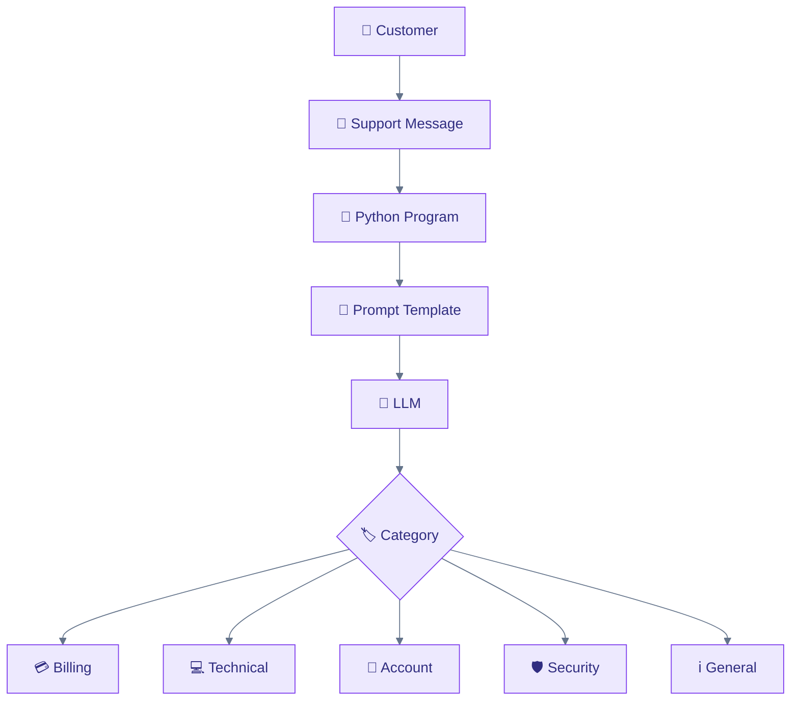

---

# ✅ 26. Assignment Requirements

Students should:

1. ask the user to enter a support request;
2. store the request in a Python variable;
3. create the prompt dynamically;
4. send the prompt to an LLM;
5. classify the ticket;
6. display the category;
7. create at least three prompt versions;
8. test each version using the same test cases;
9. compare the results; and
10. explain which prompt version they recommend.

The final prompt should clearly define:

```text
TASK
CONTEXT
ALLOWED CATEGORIES
CONSTRAINTS
OUTPUT FORMAT
```

---

# 🚨 27. Advanced Challenge

Extend the classifier so that it returns:

```text
Category:
Priority:
Summary:
```

Input:

```text
My company laptop appears to be infected with ransomware.
I cannot open any of my files.
```

Possible output:

```text
Category: Security

Priority: Critical

Summary:
Possible ransomware infection preventing file access.
```

Now ask:

> ❓ What happens if Python expects these three fields but the LLM changes the output format?

That question leads directly to Week 3.

---

# ✅ 28. Prompt Engineering Checklist

```text
╔══════════════════════════════════════════╗
║       PROMPT ENGINEERING CHECKLIST       ║
╠══════════════════════════════════════════╣
║                                          ║
║  🎯 GOAL                                 ║
║     What should the model do?            ║
║                                          ║
║  🧠 CONTEXT                              ║
║     What does the model need to know?    ║
║                                          ║
║  📏 CONSTRAINTS                          ║
║     What rules should it follow?         ║
║                                          ║
║  🧱 OUTPUT FORMAT                        ║
║     What should the answer look like?    ║
║                                          ║
║  🧩 EXAMPLES                             ║
║     Would examples clarify the task?     ║
║                                          ║
║  🧪 TEST                                 ║
║     Does it work on several inputs?      ║
║                                          ║
║  📊 EVALUATE                             ║
║     How will we measure quality?         ║
║                                          ║
╚══════════════════════════════════════════╝
```

---

# ⏰ 29. Suggested Three-Hour Teaching Plan

| Time | Activity |
|---|---|
| 00:00–00:15 | 🔁 Review Week 1 |
| 00:15–00:30 | 🔴 Weak vs 🟢 strong prompt |
| 00:30–00:50 | 🧩 Role, task, context, constraints |
| 00:50–01:10 | 🧱 Output formatting |
| 01:10–01:30 | 🎲 Zero-shot, one-shot, few-shot |
| 01:30–01:45 | ☕ Break |
| 01:45–02:05 | 🐍 Python prompt templates |
| 02:05–02:20 | ♻️ Reusable prompt functions |
| 02:20–02:35 | 🧪 Prompt versioning and evaluation |
| 02:35–02:50 | 🛠 Helpdesk classifier |
| 02:50–03:00 | 💬 Discussion and homework |

---

# 🏠 30. Week 2 Homework

Students receive:

```text
1. "My invoice contains the wrong amount."

2. "Someone changed my password."

3. "My monitor does not turn on."

4. "How can I contact your office?"

5. "I cannot sign in to my account."
```

Create:

```text
Prompt V1 → Zero-shot

Prompt V2 → Improved Zero-shot

Prompt V3 → Few-shot
```

Compare:

| Prompt | Correct Results | Format Correct | Comments |
|---|---:|---:|---|
| V1 | ? | ? | |
| V2 | ? | ? | |
| V3 | ? | ? | |

Finally answer:

> **Which prompt performed best, and why?**

---

# 🌟 31. Key Takeaways

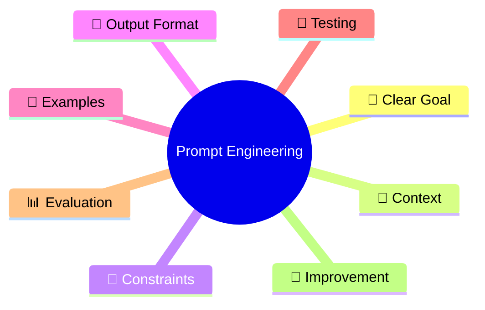

Students should finish Week 2 understanding that prompt engineering is much more than writing questions.

> **A good prompt does not simply ask the AI something. It defines the task clearly enough that the AI can become a useful component of a software application.**

---

# ➡️ 32. Connection to Week 3

Week 2 ends with a software-engineering problem.

An LLM may return:

```text
Category: Security
Priority: Critical
Summary: Possible ransomware infection
```

but another time it may return:

```text
This appears to be a critical cybersecurity incident.
I recommend sending it immediately to the security department.
```

Both are understandable to a person.

Python, however, often needs predictable data.

Therefore the next topic is:

# 🟢 Week 3 — Structured Outputs, JSON, and Pydantic

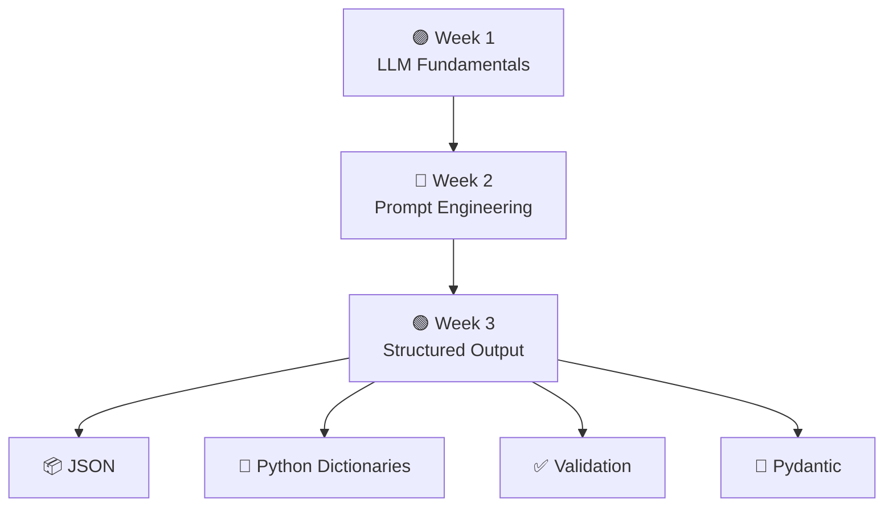

---

## 🎓 Final Message for Students

> **Prompt engineering is not about discovering magic words. It is the engineering process of defining an AI task, providing the right context and constraints, specifying the expected output, testing the result, and improving the instruction until the application behaves reliably.**

---

## 🖼 Optional Full Infographic

If you want a one-page visual summary, open:

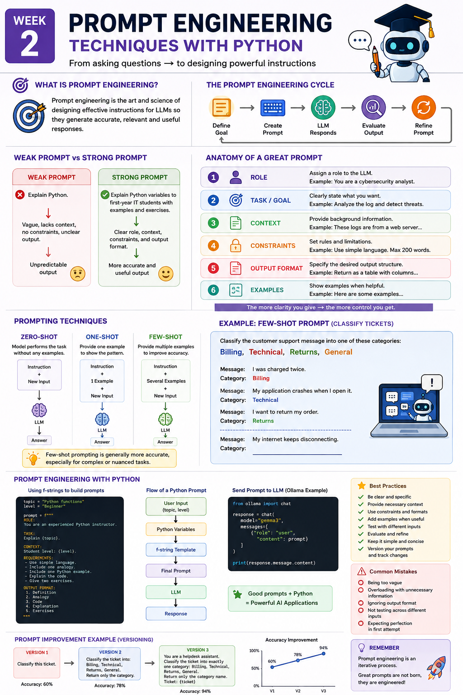
