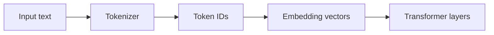
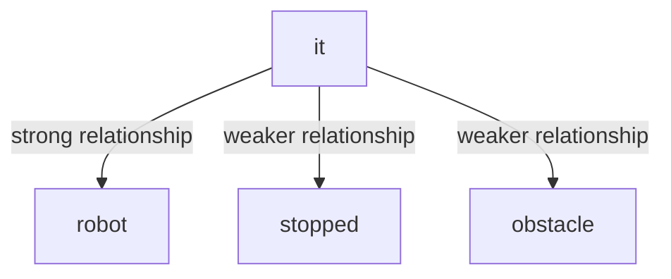
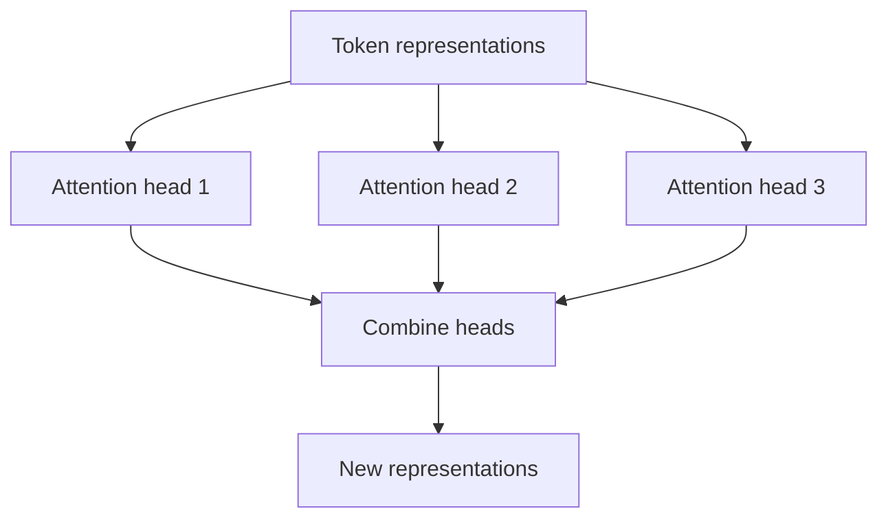
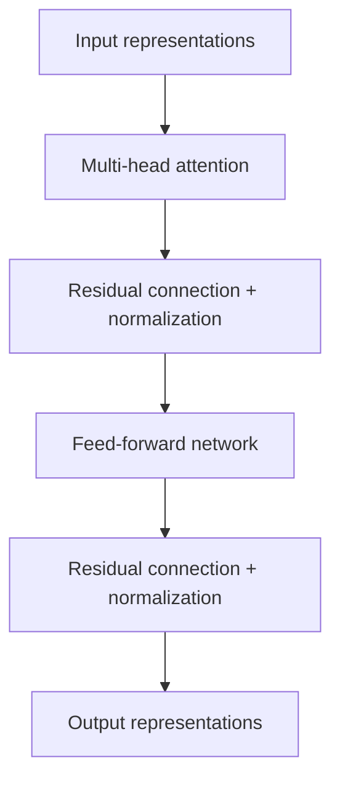
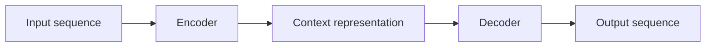
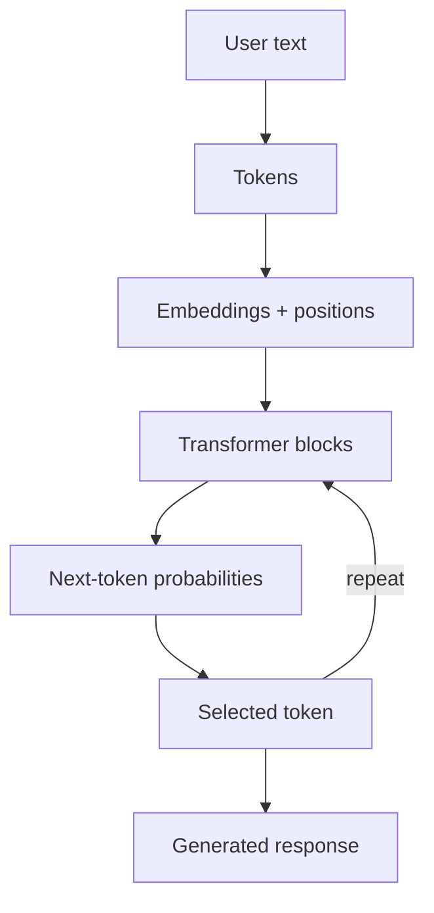

# 🤖 Transformer in Artificial Neural Networks

## A Beginner-Friendly Guide for IT Students


> **A Transformer is a neural-network architecture that uses attention to understand relationships in sequential data such as text, code, audio, and images.**

---

## 📚 Table of Contents

1. [Learning objectives](#-learning-objectives)
2. [What is a Transformer?](#-what-is-a-transformer)
3. [Why were Transformers developed?](#-why-were-transformers-developed)
4. [Where are Transformers used?](#-where-are-transformers-used)
5. [Tokens and embeddings](#-tokens-and-embeddings)
6. [Positional encoding](#-positional-encoding)
7. [Self-attention](#-self-attention)
8. [Query, Key, and Value](#-query-key-and-value)
9. [Multi-head attention](#-multi-head-attention)
10. [Feed-forward network](#-feed-forward-network)
11. [Encoder and decoder](#-encoder-and-decoder)
12. [How a Transformer processes text](#-how-a-transformer-processes-text)
13. [Training and inference](#-training-and-inference)
14. [Advantages and limitations](#-advantages-and-limitations)
15. [Practical Python demonstration](#-practical-python-demonstration)
16. [Student exercises](#-student-exercises)
17. [Summary](#-summary)

---

## 🎯 Learning Objectives

After completing this article, students should be able to:

- Define a Transformer neural network.
- Explain why attention is important.
- Describe tokens, embeddings, and positional information.
- Explain Query, Key, and Value in simple terms.
- Distinguish between encoder-only, decoder-only, and encoder–decoder models.
- Identify common applications, advantages, and limitations.

---

## 🧠 What Is a Transformer?

A **Transformer** is a type of artificial neural network designed to process relationships between elements in data. It was introduced in the 2017 research paper *Attention Is All You Need*.

Transformers were originally developed for language translation, but they are now used for:

- text generation,
- question answering,
- document summarization,
- language translation,
- computer-code generation,
- speech and audio processing,
- image recognition,
- and multimodal AI systems.

Models such as GPT, BERT, T5, and Vision Transformer are based on the Transformer architecture.

> [!NOTE]
> A Transformer is not a complete chatbot by itself. It is the underlying neural-network architecture that can be trained and used inside an AI application.

---

## 🕰️ Why Were Transformers Developed?

Before Transformers, sequential data was often processed using **Recurrent Neural Networks (RNNs)** and **Long Short-Term Memory networks (LSTMs)**.

These networks read a sentence mainly one step at a time:

```text
Word 1 → Word 2 → Word 3 → Word 4 → Result
```

This approach has two important challenges:

1. Sequential processing can be slow during training.
2. Information from the beginning of a long sequence can become difficult to preserve.

Transformers use attention to compare many tokens directly. During training, this also allows more parallel computation.

| Architecture | Basic processing style | Long-range relationships | Training parallelism |
|---|---|---|---|
| RNN | Sequential | Difficult | Low |
| LSTM | Sequential with memory gates | Better than RNN | Low |
| Transformer | Attention across tokens | Strong | High |

---

## 🌍 Where Are Transformers Used?

| Area | Example task |
|---|---|
| Natural-language processing | Generate or summarize text |
| Translation | Translate Danish into English |
| Programming | Explain or generate Python code |
| Search | Find semantically relevant documents |
| Computer vision | Classify objects in an image |
| Audio | Recognize or generate speech |
| Robotics | Interpret instructions and sensor information |
| Education | Create explanations, quizzes, and exercises |

---

## 🔤 Tokens and Embeddings

A Transformer does not directly understand words. Input is first divided into smaller units called **tokens**.

```text
"Transformers understand language"
               ↓
["Transform", "ers", " understand", " language"]
```

The exact division depends on the tokenizer. A token can represent:

- a complete word,
- part of a word,
- punctuation,
- or another meaningful symbol.

Each token is converted into a numerical vector called an **embedding**. During training, embeddings develop representations that capture useful patterns and similarities.



---

## 📍 Positional Encoding

Attention alone does not automatically know token order. The model therefore receives **positional information** together with token embeddings.

Word order matters:

```text
The robot follows the student.
The student follows the robot.
```

The sentences use similar words but have different meanings. Positional information helps the model distinguish their order.

A simplified representation is:

```text
Input representation = Token embedding + Position information
```

Different Transformer models may use learned position embeddings, sinusoidal encodings, or relative/rotary position methods.

---

## 🔍 Self-Attention

**Self-attention** allows every token to examine other relevant tokens in the same sequence.

Consider:

```text
The robot stopped because it detected an obstacle.
```

To interpret **it**, the model should connect that token strongly with **robot**. Attention assigns different weights to possible relationships.



Attention does not provide human consciousness or genuine comprehension. It is a mathematical mechanism for learning and applying relationships in data.

---

## 🔑 Query, Key, and Value

For each token, the model creates three learned vectors:

| Vector | Simple question | Purpose |
|---|---|---|
| Query (Q) | What information am I looking for? | Searches for relevant tokens |
| Key (K) | What information do I contain? | Is compared with a query |
| Value (V) | What information can I contribute? | Supplies information to the result |

The scaled dot-product attention formula is:

$$
\operatorname{Attention}(Q,K,V)=
\operatorname{softmax}\left(\frac{QK^T}{\sqrt{d_k}}\right)V
$$

In simplified steps:

1. Compare each Query with relevant Keys.
2. Scale the scores for numerical stability.
3. Use softmax to convert scores into attention weights.
4. Multiply the weights by the Values.
5. Combine the weighted information.

> [!TIP]
> Query, Key, and Value are learned numerical vectors—not literal questions, database keys, or stored sentences.

---

## 👥 Multi-Head Attention

A Transformer normally uses several attention operations called **attention heads**.

Different heads can learn different relationships, such as:

- grammatical structure,
- nearby word connections,
- long-distance dependencies,
- references between pronouns and nouns,
- or relationships specific to the training task.



Using multiple heads allows the model to examine several relationship patterns at the same time.

---

## ⚙️ Feed-Forward Network

After attention combines contextual information, each token representation passes through a **feed-forward neural network**.

A typical Transformer block also contains:

- residual connections,
- layer normalization,
- dropout during training,
- multi-head attention,
- and a feed-forward network.



Many such blocks are stacked to form a deep model.

---

## 🏗️ Encoder and Decoder

The original Transformer has two major parts.

### Encoder

The encoder builds contextual representations of the input. It is especially useful for understanding and classification tasks.

### Decoder

The decoder generates an output sequence. It normally uses **causal masking**, which prevents a token from looking at future output tokens during generation.

### Encoder–decoder

An encoder–decoder model first represents the input and then generates a related output.

| Architecture | Main purpose | Example model family |
|---|---|---|
| Encoder-only | Understand or classify input | BERT |
| Decoder-only | Generate the next token | GPT |
| Encoder–decoder | Transform input into output | T5 |



---

## 🔄 How a Transformer Processes Text

Suppose the user enters:

```text
Explain a Python loop.
```

A simplified process is:

1. The tokenizer divides the text into tokens.
2. Tokens are converted to numerical IDs.
3. Embeddings represent the tokens as vectors.
4. Positional information represents token order.
5. Transformer blocks apply attention and feed-forward transformations.
6. The model calculates probabilities for possible next tokens.
7. A decoding strategy selects a token.
8. The process repeats until the answer is complete.



---

## 🎓 Training and Inference

### Training

During training, the model processes many examples and adjusts its parameters to reduce prediction error. A language model may learn by predicting missing or next tokens, depending on its architecture and objective.

### Inference

Inference is the stage where a trained model receives new input and produces a prediction or response. Parameters are generally not retrained for every normal user prompt.

| Training | Inference |
|---|---|
| Learns patterns from data | Applies learned patterns |
| Updates model parameters | Normally keeps parameters fixed |
| Requires substantial computation | Usually requires less computation per request |
| Happens before deployment | Happens when the model is used |

---

## ✅ Advantages and Limitations

### Advantages

- Captures relationships between distant tokens.
- Supports highly parallel training.
- Scales to large datasets and models.
- Can be adapted to many data types and tasks.
- Produces rich contextual representations.

### Limitations

- Training large models requires substantial computation and energy.
- Attention can become expensive for very long sequences.
- Models may generate incorrect or invented information.
- Outputs can reflect problems or biases in training data.
- A model does not automatically verify truth or understand like a human.
- Context-window limits restrict how much input can be processed at once.

> [!WARNING]
> Fluent output is not proof that an answer is correct. Important information should be checked against reliable sources.

---

## 🐍 Practical Python Demonstration

The following simplified program calculates attention weights. It is a learning demonstration, not a full Transformer.

```python
import numpy as np


def softmax(values):
    shifted = values - np.max(values, axis=-1, keepdims=True)
    exponentials = np.exp(shifted)
    return exponentials / np.sum(exponentials, axis=-1, keepdims=True)


# Three tokens represented by small example vectors
query = np.array([[1.0, 0.0],
                  [0.0, 1.0],
                  [1.0, 1.0]])

key = np.array([[1.0, 0.0],
                [0.0, 1.0],
                [1.0, 1.0]])

value = np.array([[10.0, 0.0],
                  [0.0, 10.0],
                  [5.0, 5.0]])

d_k = key.shape[-1]
scores = query @ key.T / np.sqrt(d_k)
weights = softmax(scores)
attention_output = weights @ value

print("Attention weights:\n", weights)
print("\nAttention output:\n", attention_output)
```

Install NumPy if necessary:

```bash
pip install numpy
```

The demonstration performs the main mathematical steps:

```text
Query × Keyᵀ → Scale → Softmax → Multiply by Value
```

---

## 🧪 Student Exercises

### Exercise 1 — Explain the Concepts

Explain these terms in your own words:

1. Token
2. Embedding
3. Positional information
4. Self-attention
5. Query, Key, and Value

### Exercise 2 — Analyze a Sentence

Consider:

```text
The student connected the sensor because it was required by the robot.
```

Discuss what **it** might refer to. Which words should receive attention, and why might the sentence be ambiguous?

### Exercise 3 — Compare Architectures

Create a table comparing:

- an RNN,
- an LSTM,
- and a Transformer.

Compare their sequence processing, memory, training parallelism, and common uses.

### Exercise 4 — Run the Python Demo

1. Run the NumPy example.
2. Change one Query vector.
3. Observe how the weights change.
4. Explain why the attention output changes.

### Exercise 5 — Choose an Architecture

Choose the most suitable Transformer type for each task and explain your decision:

1. Classifying customer reviews
2. Generating Python code
3. Translating Danish text into English

Choose between encoder-only, decoder-only, and encoder–decoder.

---

## 📝 Summary

A Transformer is an artificial neural-network architecture that uses attention to model relationships between elements in data.

Its central components include:

- tokenization,
- embeddings,
- positional information,
- self-attention,
- Query, Key, and Value vectors,
- multi-head attention,
- feed-forward networks,
- encoders and decoders.

The central learning idea is:

```text
Input
  ↓
Tokens
  ↓
Embeddings + Position
  ↓
Attention + Neural-Network Layers
  ↓
Contextual Representations
  ↓
Prediction or Generated Output
```

> [!IMPORTANT]
> **Transformers use attention to determine which parts of the input are most relevant when producing each representation or output token.**

---

### 🚀 Tokens → Attention → Context → Prediction
