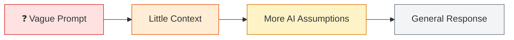
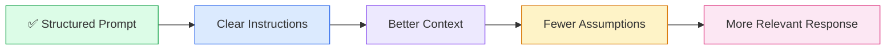
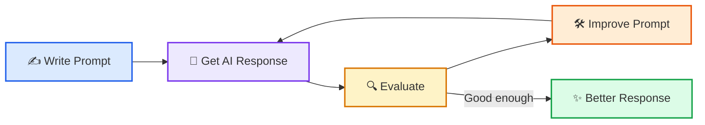
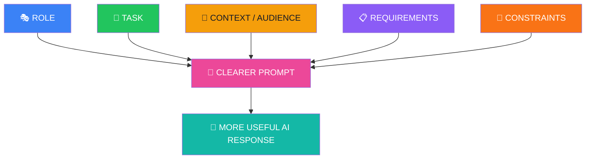

# 🤖 Introduction to Prompt Engineering

### A Beginner-Friendly Guide for IT Students


**Learn how to turn vague questions into clear, structured prompts that produce more useful AI responses.**

---


---

## 📚 Table of Contents

1. [What Is Prompt Engineering?](#-1-what-is-prompt-engineering)
2. [What Is a Prompt?](#-2-what-is-a-prompt)
3. [Prompt 1: A Weak Prompt](#-3-prompt-1-a-weak-prompt)
4. [Prompt 2: A Structured Prompt](#-4-prompt-2-a-structured-prompt)
5. [Which Prompt Is Better?](#-5-which-prompt-is-better)
6. [Anatomy of a Good Prompt](#-6-anatomy-of-a-good-prompt)
7. [Role](#-7-role)
8. [Task](#-8-task)
9. [Context and Audience](#-9-context-and-audience)
10. [Requirements](#-10-requirements)
11. [Constraints](#-11-constraints)
12. [How a Prompt Works](#-12-how-a-prompt-works)
13. [Prompt Engineering Formula](#-13-prompt-engineering-formula)
14. [Example: Python Loops](#-14-example-python-loops)
15. [Example: Artificial Intelligence](#-15-example-artificial-intelligence)
16. [Example: Cybersecurity](#-16-example-cybersecurity)
17. [Longer Is Not Always Better](#-17-longer-is-not-always-better)
18. [Prompt Engineering for Teachers](#-18-prompt-engineering-for-teachers)
19. [Iterative Prompt Improvement](#-19-iterative-prompt-improvement)
20. [Reusable Prompt Template](#-20-reusable-prompt-template)
21. [Student Activities](#-21-student-activities)
22. [Summary](#-22-summary)
23. [Key Takeaway](#-23-key-takeaway)

---

## 🎯 Learning Objectives

After completing this article, students should be able to:

| Objective | What the student should understand |
|---|---|
| 🧠 Define | Explain what a prompt and Prompt Engineering are |
| 🔍 Compare | Recognize the difference between weak and structured prompts |
| 🧩 Structure | Identify role, task, context, requirements, and constraints |
| ✍️ Create | Write a structured prompt for an IT-related task |
| 🔁 Improve | Evaluate an AI response and refine the original prompt |

> [!TIP]
> **Main idea:** AI works better when we communicate our expectations clearly.

---

# 🧠 1. What Is Prompt Engineering?

**Prompt Engineering** is the process of designing clear, structured, and useful instructions for an AI model.

When we communicate with an AI system such as ChatGPT, we give it a **prompt**.

The quality of the response often depends on how clearly the prompt explains:

- what we want,
- who the answer is for,
- how the answer should be written,
- what information should be included,
- and what should be avoided.

A short prompt can work, but a structured prompt gives us greater control over the result.

> [!NOTE]
> Prompt Engineering is not about making prompts unnecessarily long.  
> It is about making instructions **clear, specific, relevant, and structured**.

---

# 💬 2. What Is a Prompt?

A **prompt** is an instruction, question, command, or piece of information given to an AI model.

For example:

```text
Explain Python.
```

This is a valid prompt.

However, it is very general.

The AI does not know:

- Who is learning Python?
- Is the learner a beginner or advanced programmer?
- Which Python topic should be explained?
- How detailed should the explanation be?
- Should code examples be included?
- Should exercises be included?
- What response format should be used?

Because the prompt gives very little information, the AI must make many assumptions.

---

# ❌ 3. Prompt 1: A Weak Prompt

Consider the following prompt:

```text
Explain Python.
```

This prompt is understandable, but it is very broad.

The AI may decide to explain:

- Python history
- Variables
- Data types
- Conditions
- Loops
- Functions
- Object-oriented programming
- Artificial intelligence
- Data science
- Web development

The user has not clearly defined the learning goal.

### Why is it weak?

| Problem | Explanation |
|---|---|
| ❌ Too general | The topic is very broad |
| ❌ No role | The AI does not know what perspective to take |
| ❌ No audience | The learner's level is unknown |
| ❌ No format | The response structure is not defined |
| ❌ No boundaries | The AI decides what to include |

---

# ✅ 4. Prompt 2: A Structured Prompt

Now compare it with the following prompt:

```text
You are an experienced Python teacher.

Explain Python variables to a first-semester
IT student who has never programmed before.

Requirements:

- Use simple language.
- Start with a definition.
- Give one real-world analogy.
- Provide one executable Python example.
- Explain the code.
- Give two exercises.
- Do not provide solutions.
```

This prompt tells the AI much more.

It defines:

- 🎭 a **role**
- 🎯 a **task**
- 👥 an **audience**
- 📚 the learner's **context**
- 📋 clear **requirements**
- 🚧 a **constraint**

This reduces uncertainty and gives the AI clearer direction.

---

# 🏆 5. Which Prompt Is Better?

For this teaching situation, **Prompt 2 is better**.

Prompt 1 is not incorrect. It is simply too broad for a controlled classroom learning activity.

| Prompt 1 | Prompt 2 |
|---|---|
| ❌ Very general | ✅ Specific and clear |
| ❌ No role | ✅ Defines the AI role |
| ❌ No audience | ✅ Defines the target audience |
| ❌ No learner level | ✅ Specifies a beginner |
| ❌ Broad topic | ✅ Focuses on Python variables |
| ❌ No response structure | ✅ Gives clear requirements |
| ❌ No exercise requirement | ✅ Requests two exercises |
| ❌ AI decides most details | ✅ Teacher controls important details |

> [!IMPORTANT]
> **Better instructions usually lead to more relevant and more predictable AI responses.**

---

# 🧩 6. Anatomy of a Good Prompt

A useful beginner model is:


A structured prompt does not need every possible element every time, but these five elements provide an excellent foundation.

---

# 🎭 7. Role

The **role** tells the AI what perspective it should take.

Example:

```text
You are an experienced Python teacher.
```

Other examples include:

```text
You are a cybersecurity instructor.
```

```text
You are a Python programming tutor.
```

```text
You are an experienced software developer.
```

```text
You are a technical support specialist.
```

The role helps guide the style, terminology, and point of view of the answer.

### Example

Without a role:

```text
Explain Python variables.
```

With a role:

```text
You are an experienced Python teacher.

Explain Python variables.
```

The second prompt gives the AI additional context about how it should approach the task.

---

# 🎯 8. Task

The **task** tells the AI exactly what it should do.

Example:

```text
Explain Python variables.
```

A clear task is better than a vague request.

### Broad task

```text
Tell me about Python.
```

### More specific task

```text
Explain Python lists and how they are used.
```

The second version provides a much clearer goal.

> [!TIP]
> Try to use action words such as:
>
> **Explain, compare, summarize, create, classify, analyze, rewrite, generate, evaluate, or demonstrate.**

---

# 👥 9. Context and Audience

The **context** explains the situation.

The **audience** tells the AI who the answer is for.

Example:

```text
Explain Python variables to a first-semester
IT student who has never programmed before.
```

The AI can now infer that:

- the learner is a beginner,
- the learner studies IT,
- advanced terminology should be limited,
- the explanation should be easy to follow,
- and examples should be beginner-friendly.

Compare:

```text
Explain Python variables.
```

with:

```text
Explain Python variables to a first-semester
IT student who has never programmed before.
```

The second prompt gives far more useful teaching context.

---

# 📋 10. Requirements

**Requirements** tell the AI what the answer should contain.

Example:

```text
Requirements:

- Use simple language.
- Start with a definition.
- Give one real-world analogy.
- Provide one executable Python example.
- Explain the code.
- Give two exercises.
```

Requirements can control:

- length,
- number of examples,
- level of detail,
- formatting,
- diagrams,
- code,
- exercises,
- tables,
- tone,
- language.

### Another example

```text
Requirements:

- Explain the topic in less than 500 words.
- Use a comparison table.
- Include one Python example.
- Finish with three review questions.
```

---

# 🚧 11. Constraints

A **constraint** tells the AI what it should not do, or sets a boundary.

Example:

```text
Do not provide solutions.
```

Other examples:

```text
Do not use advanced Python concepts.
```

```text
Keep the explanation under 500 words.
```

```text
Do not use external Python libraries.
```

```text
Do not use mathematical formulas.
```

Constraints are particularly useful in education because teachers may want students to solve a problem independently.

---

# ⚙️ 12. How a Prompt Works

At a simple conceptual level:


A clearer prompt usually gives the AI more useful information to work with.

### Vague prompt



### Structured prompt



---

# 🧮 13. Prompt Engineering Formula

A simple beginner formula is:

```text
GOOD PROMPT
=
ROLE
+
TASK
+
CONTEXT / AUDIENCE
+
REQUIREMENTS
+
CONSTRAINTS
```

Another useful version is:

```text
ROLE + TASK + CONTEXT + FORMAT + CONSTRAINTS
```

### Quick checklist

Before sending a prompt, ask:

- 🎭 **Who** should the AI act as?
- 🎯 **What** should it do?
- 👥 **Who** is the answer for?
- 📋 **What** should be included?
- 🧱 **How** should the answer be presented?
- 🚧 **What** should be avoided?

---

# 🐍 14. Example: Python Loops

## Weak Prompt

```text
Explain loops.
```

This prompt gives almost no information about the learner or the expected response.

## Improved Prompt

```text
You are an experienced Python teacher.

Explain Python for-loops to a first-semester
IT student who has never programmed before.

Requirements:

- Use simple language.
- Start with a definition.
- Give one real-world analogy.
- Provide two executable Python examples.
- Explain each example step by step.
- Give two exercises.
- Do not provide the solutions.
```

### What improved?

| Element | Added information |
|---|---|
| 🎭 Role | Experienced Python teacher |
| 🎯 Task | Explain Python `for` loops |
| 👥 Audience | First-semester beginner |
| 📋 Requirements | Definition, analogy, examples, exercises |
| 🚧 Constraint | No solutions |

---

# 🤖 15. Example: Artificial Intelligence

## Simple Prompt

```text
Explain AI.
```

## Structured Prompt

```text
You are an AI instructor.

Explain Artificial Intelligence to first-semester
IT students with no previous AI experience.

Requirements:

- Use simple language.
- Define Artificial Intelligence.
- Give three real-world examples.
- Explain the difference between AI and traditional software.
- Use a simple text diagram.
- Give three discussion questions.
- Keep the explanation beginner-friendly.
```

The structured prompt gives the AI a clear audience, learning goal, and output structure.

---

# 🛡️ 16. Example: Cybersecurity

## Simple Prompt

```text
Explain phishing.
```

## Better Prompt

```text
You are a cybersecurity instructor.

Explain phishing attacks to first-semester
IT students.

Requirements:

- Use beginner-friendly language.
- Start with a definition.
- Give one realistic example.
- Explain how a phishing attack works step by step.
- List five warning signs.
- Give three classroom discussion questions.
- Do not include instructions for performing an attack.
```

This prompt clearly defines both the educational goal and the safety boundary.

---

# 📏 17. Longer Is Not Always Better

Prompt Engineering does **not** mean writing the longest possible prompt.

A long prompt can still be unclear.

The goal is to make the prompt:

- ✅ Clear
- ✅ Specific
- ✅ Relevant
- ✅ Structured
- ✅ Easy to understand

For example:

```text
Explain Python variables to a beginner.

Use simple language and provide one code example.
```

This short prompt is already better than:

```text
Explain variables.
```

> [!WARNING]
> More words do not automatically mean a better prompt.  
> **Useful information matters more than unnecessary detail.**

---

# 👨‍🏫 18. Prompt Engineering for Teachers

Prompt Engineering is especially useful for educators.

A teacher can control:

- 🎓 Learning level
- 🗣️ Language difficulty
- 💻 Number of code examples
- 🧪 Type of exercises
- ✅ Whether solutions are included
- 📏 Response length
- 📊 Tables and diagrams
- 🧠 Review questions
- 📝 Assignment structure

### Example: Generate a classroom exercise

```text
You are a Python teacher.

Create a beginner exercise about Python variables
for first-semester IT students.

The exercise should take approximately 20 minutes.

Include:

- A short scenario
- Five requirements
- Expected output format

Do not include Python code.
Do not provide the solution.
```

This gives the teacher greater control over the learning material.

---

# 🔁 19. Iterative Prompt Improvement

A prompt does not always need to be perfect on the first attempt.

Prompt Engineering can be an **iterative process**.



If the answer is too advanced, refine the prompt:

```text
Use simpler language suitable for a complete beginner.
```

If the answer is too long:

```text
Keep the explanation under 300 words.
```

If more practical examples are needed:

```text
Provide three real-world examples from IT.
```

If the answer needs a specific structure:

```text
Present the answer using headings, a table, and a short summary.
```

The cycle can be repeated until the response is suitable for the task.

---

# 🧰 20. Reusable Prompt Template

Students can use this template when creating prompts:

```text
ROLE:
You are a/an [role].

TASK:
[Explain clearly what the AI should do.]

AUDIENCE / CONTEXT:
The response is for [target audience].
They have [background / experience level].

REQUIREMENTS:
- [Requirement 1]
- [Requirement 2]
- [Requirement 3]
- [Requirement 4]

FORMAT:
Present the response as [article / table / bullet list / tutorial / code].

CONSTRAINTS:
- Do not [restriction 1].
- Avoid [restriction 2].
```

### Example

```text
ROLE:
You are an experienced networking teacher.

TASK:
Explain the difference between 2.4 GHz and 5 GHz Wi-Fi.

AUDIENCE / CONTEXT:
The response is for first-semester IT students
with basic computer knowledge.

REQUIREMENTS:
- Use simple language.
- Explain speed, range, and interference.
- Provide one comparison table.
- Give two real-world examples.

FORMAT:
Use headings and a comparison table.

CONSTRAINTS:
- Do not use advanced radio-frequency mathematics.
```

---

# 🧪 21. Student Activities

## Exercise 1 — Improve a Weak Prompt

Consider:

```text
Explain databases.
```

Rewrite the prompt so that it contains:

- 🎭 A role
- 🎯 A clear task
- 👥 A target audience
- 📋 At least four requirements
- 🚧 At least one constraint

**Do not generate the answer yet.**  
First concentrate on improving the prompt itself.

---

## Exercise 2 — Create Your Own Prompt

Choose one topic:

- 🐍 Python functions
- 🌐 Computer networks
- 🛡️ Cybersecurity
- 🤖 Artificial Intelligence
- 🗄️ Databases
- ☁️ Cloud computing
- 📡 Internet of Things
- 🤖 Robotics

Create a structured prompt using:

```text
Role:
Task:
Audience:
Requirements:
Format:
Constraints:
```

Then test your prompt with an AI model and evaluate the response.

---

## Exercise 3 — Compare Two Prompts

### Prompt A

```text
Explain machine learning.
```

### Prompt B

```text
You are an experienced machine-learning teacher.

Explain machine learning to a first-semester
IT student with no previous AI experience.

Use simple language.

Include:

- A definition
- One real-world analogy
- Three real-world examples
- A simple diagram
- Two discussion questions

Do not use mathematical formulas.
```

### Discussion

Which prompt is better for a first-semester IT student?

Consider:

- audience,
- context,
- requirements,
- structure,
- constraints,
- and expected quality of the response.

---

# 📝 22. Summary

Prompt Engineering is the skill of designing instructions that help an AI model understand what we need.

A useful beginner model is:



A structured prompt gives the AI:

- clearer instructions,
- better context,
- fewer areas to guess,
- and a more specific target.

---

# ⭐ 23. Key Takeaway

> [!IMPORTANT]
> ## Better Prompt → Better Direction → More Useful Response
>
> Before sending a prompt, think about:
>
> **Role + Task + Audience + Requirements + Constraints**

```text
Who should the AI be?
        ↓
What should it do?
        ↓
Who is the answer for?
        ↓
What should be included?
        ↓
How should it be presented?
        ↓
What should be avoided?
        ↓
Send the Prompt
```

Prompt Engineering is not simply the skill of asking AI questions.

It is the skill of **communicating requirements clearly**.

---

### 🚀 Practice → Evaluate → Improve → Repeat

**Clear prompts help humans communicate more effectively with AI.**
