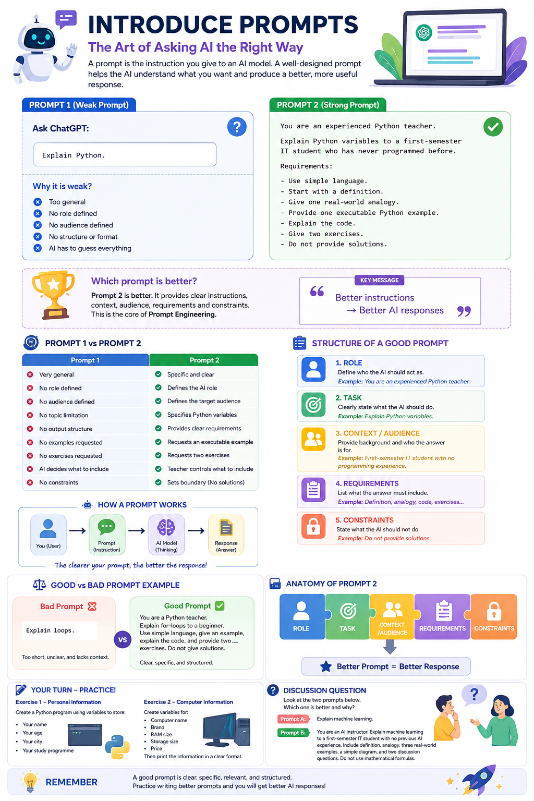
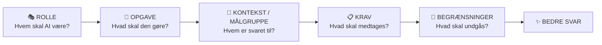
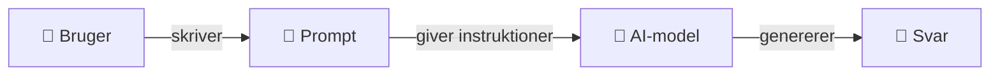
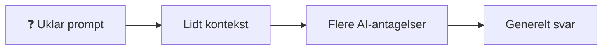
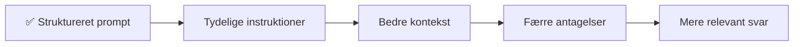
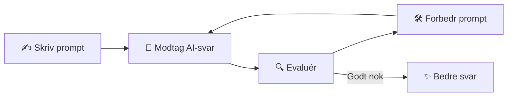
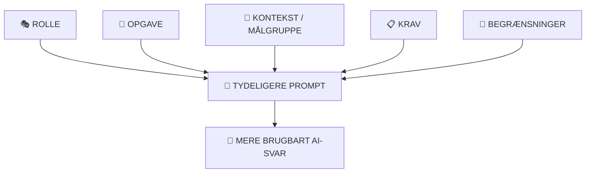

# 🤖 Introduktion til prompt engineering

### En begyndervenlig guide til IT-studerende


**Lær at omdanne uklare spørgsmål til tydelige og strukturerede prompts, der giver mere brugbare AI-svar.**

---



---

## 📚 Indholdsfortegnelse

1. [Hvad er prompt engineering?](#-1-hvad-er-prompt-engineering)
2. [Hvad er en prompt?](#-2-hvad-er-en-prompt)
3. [Prompt 1: En svag prompt](#-3-prompt-1-en-svag-prompt)
4. [Prompt 2: En struktureret prompt](#-4-prompt-2-en-struktureret-prompt)
5. [Hvilken prompt er bedst?](#-5-hvilken-prompt-er-bedst)
6. [Opbygningen af en god prompt](#-6-opbygningen-af-en-god-prompt)
7. [Rolle](#-7-rolle)
8. [Opgave](#-8-opgave)
9. [Kontekst og målgruppe](#-9-kontekst-og-målgruppe)
10. [Krav](#-10-krav)
11. [Begrænsninger](#-11-begrænsninger)
12. [Hvordan virker en prompt?](#-12-hvordan-virker-en-prompt)
13. [Formel til prompt engineering](#-13-formel-til-prompt-engineering)
14. [Eksempel: Python-løkker](#-14-eksempel-python-løkker)
15. [Eksempel: Kunstig intelligens](#-15-eksempel-kunstig-intelligens)
16. [Eksempel: Cybersikkerhed](#-16-eksempel-cybersikkerhed)
17. [Længere er ikke altid bedre](#-17-længere-er-ikke-altid-bedre)
18. [Prompt engineering for undervisere](#-18-prompt-engineering-for-undervisere)
19. [Iterativ forbedring af prompts](#-19-iterativ-forbedring-af-prompts)
20. [Genanvendelig promptskabelon](#-20-genanvendelig-promptskabelon)
21. [Studenteraktiviteter](#-21-studenteraktiviteter)
22. [Opsummering](#-22-opsummering)
23. [Vigtigste pointe](#-23-vigtigste-pointe)

---

## 🎯 Læringsmål

Efter at have gennemgået artiklen skal de studerende kunne:

| Mål | Det skal den studerende forstå |
|---|---|
| 🧠 Definere | Forklare, hvad en prompt og prompt engineering er |
| 🔍 Sammenligne | Genkende forskellen på svage og strukturerede prompts |
| 🧩 Strukturere | Identificere rolle, opgave, kontekst, krav og begrænsninger |
| ✍️ Udarbejde | Skrive en struktureret prompt til en IT-relateret opgave |
| 🔁 Forbedre | Evaluere et AI-svar og forbedre den oprindelige prompt |

> [!TIP]
> **Hovedidé:** AI fungerer bedre, når vi kommunikerer vores forventninger tydeligt.

---

# 🧠 1. Hvad er prompt engineering?

**Prompt engineering** er processen med at udforme tydelige, strukturerede og brugbare instruktioner til en AI-model.

Når vi kommunikerer med et AI-system som ChatGPT, giver vi det en **prompt**.

Kvaliteten af svaret afhænger ofte af, hvor tydeligt prompten forklarer:

- hvad vi ønsker,
- hvem svaret er til,
- hvordan svaret skal skrives,
- hvilke oplysninger der skal medtages,
- og hvad der skal undgås.

En kort prompt kan fungere, men en struktureret prompt giver os større kontrol over resultatet.

> [!NOTE]
> Prompt engineering handler ikke om at gøre prompts unødvendigt lange.  
> Det handler om at gøre instruktionerne **tydelige, specifikke, relevante og strukturerede**.

---

# 💬 2. Hvad er en prompt?

En **prompt** er en instruktion, et spørgsmål, en kommando eller information, som gives til en AI-model.

Eksempel:

```text
Forklar Python.
```

Dette er en gyldig prompt, men den er meget generel.

AI-modellen ved ikke:

- Hvem skal lære Python?
- Er personen begynder eller erfaren programmør?
- Hvilket Python-emne skal forklares?
- Hvor detaljeret skal forklaringen være?
- Skal der medtages kodeeksempler?
- Skal der medtages øvelser?
- Hvilket svarformat skal anvendes?

Da prompten indeholder meget lidt information, må AI-modellen selv foretage mange antagelser.

---

# ❌ 3. Prompt 1: En svag prompt

Overvej denne prompt:

```text
Forklar Python.
```

Prompten er forståelig, men meget bred. AI-modellen kan vælge at forklare:

- Pythons historie
- Variabler
- Datatyper
- Betingelser
- Løkker
- Funktioner
- Objektorienteret programmering
- Kunstig intelligens
- Data science
- Webudvikling

Brugeren har ikke tydeligt defineret læringsmålet.

### Hvorfor er den svag?

| Problem | Forklaring |
|---|---|
| ❌ For generel | Emnet er meget bredt |
| ❌ Ingen rolle | AI-modellen kender ikke det ønskede perspektiv |
| ❌ Ingen målgruppe | Den lærendes niveau er ukendt |
| ❌ Intet format | Svarets struktur er ikke defineret |
| ❌ Ingen grænser | AI-modellen bestemmer selv indholdet |

---

# ✅ 4. Prompt 2: En struktureret prompt

Sammenlign nu med følgende prompt:

```text
Du er en erfaren Python-underviser.

Forklar Python-variabler til en IT-studerende på
første semester, som aldrig har programmeret før.

Krav:

- Brug et enkelt sprog.
- Begynd med en definition.
- Giv én analogi fra virkeligheden.
- Vis ét Python-eksempel, der kan køres.
- Forklar koden.
- Giv to øvelser.
- Giv ikke løsningerne.
```

Denne prompt giver AI-modellen langt flere oplysninger. Den definerer:

- 🎭 en **rolle**
- 🎯 en **opgave**
- 👥 en **målgruppe**
- 📚 den lærendes **kontekst**
- 📋 tydelige **krav**
- 🚧 en **begrænsning**

Det reducerer usikkerheden og giver AI-modellen en tydeligere retning.

---

# 🏆 5. Hvilken prompt er bedst?

I denne undervisningssituation er **prompt 2 bedst**.

Prompt 1 er ikke forkert. Den er blot for bred til en kontrolleret læringsaktivitet.

| Prompt 1 | Prompt 2 |
|---|---|
| ❌ Meget generel | ✅ Specifik og tydelig |
| ❌ Ingen rolle | ✅ Definerer AI-modellens rolle |
| ❌ Ingen målgruppe | ✅ Definerer målgruppen |
| ❌ Intet niveau | ✅ Angiver begynderniveau |
| ❌ Bredt emne | ✅ Fokuserer på Python-variabler |
| ❌ Ingen svarstruktur | ✅ Angiver tydelige krav |
| ❌ Intet krav om øvelser | ✅ Beder om to øvelser |
| ❌ AI vælger de fleste detaljer | ✅ Underviseren styrer de vigtige detaljer |

> [!IMPORTANT]
> **Bedre instruktioner fører som regel til mere relevante og forudsigelige AI-svar.**

---

# 🧩 6. Opbygningen af en god prompt

En brugbar begyndermodel er:



En struktureret prompt behøver ikke altid at indeholde alle tænkelige elementer, men disse fem elementer er et fremragende udgangspunkt.

---

# 🎭 7. Rolle

**Rollen** fortæller AI-modellen, hvilket perspektiv den skal anvende.

```text
Du er en erfaren Python-underviser.
```

Andre eksempler:

```text
Du er underviser i cybersikkerhed.
```

```text
Du er vejleder i Python-programmering.
```

```text
Du er en erfaren softwareudvikler.
```

```text
Du er specialist i teknisk support.
```

Rollen hjælper med at styre svarets stil, terminologi og synsvinkel.

Uden rolle:

```text
Forklar Python-variabler.
```

Med rolle:

```text
Du er en erfaren Python-underviser.
Forklar Python-variabler.
```

Den anden prompt giver AI-modellen ekstra kontekst om, hvordan opgaven skal løses.

---

# 🎯 8. Opgave

**Opgaven** fortæller præcist, hvad AI-modellen skal gøre.

```text
Forklar Python-variabler.
```

En tydelig opgave er bedre end en uklar forespørgsel.

### Bred opgave

```text
Fortæl mig om Python.
```

### Mere specifik opgave

```text
Forklar Python-lister, og hvordan de anvendes.
```

Den anden version har et langt tydeligere mål.

> [!TIP]
> Brug gerne handlingsord som:
>
> **Forklar, sammenlign, opsummér, opret, klassificér, analysér, omskriv, generér, evaluér eller demonstrér.**

---

# 👥 9. Kontekst og målgruppe

**Konteksten** forklarer situationen. **Målgruppen** fortæller, hvem svaret er beregnet til.

```text
Forklar Python-variabler til en IT-studerende på
første semester, som aldrig har programmeret før.
```

AI-modellen kan nu udlede, at:

- den lærende er begynder,
- den lærende studerer IT,
- avanceret terminologi bør begrænses,
- forklaringen skal være let at følge,
- og eksemplerne skal være begyndervenlige.

Sammenlign:

```text
Forklar Python-variabler.
```

med:

```text
Forklar Python-variabler til en IT-studerende på
første semester, som aldrig har programmeret før.
```

Den anden prompt giver en langt mere brugbar undervisningskontekst.

---

# 📋 10. Krav

**Krav** fortæller AI-modellen, hvad svaret skal indeholde.

```text
Krav:

- Brug et enkelt sprog.
- Begynd med en definition.
- Giv én analogi fra virkeligheden.
- Vis ét Python-eksempel, der kan køres.
- Forklar koden.
- Giv to øvelser.
```

Krav kan styre:

- længde,
- antal eksempler,
- detaljeringsgrad,
- formatering,
- diagrammer,
- kode,
- øvelser,
- tabeller,
- tone,
- sprog.

Et andet eksempel:

```text
Krav:

- Forklar emnet med højst 500 ord.
- Brug en sammenligningstabel.
- Medtag ét Python-eksempel.
- Afslut med tre repetitionsspørgsmål.
```

---

# 🚧 11. Begrænsninger

En **begrænsning** fortæller AI-modellen, hvad den ikke må gøre, eller fastsætter en grænse.

```text
Giv ikke løsningerne.
```

Andre eksempler:

```text
Brug ikke avancerede Python-koncepter.
```

```text
Hold forklaringen under 500 ord.
```

```text
Brug ikke eksterne Python-biblioteker.
```

```text
Brug ikke matematiske formler.
```

Begrænsninger er særligt nyttige i undervisning, hvor de studerende selv skal løse en opgave.

---

# ⚙️ 12. Hvordan virker en prompt?

På et enkelt, konceptuelt niveau:



En tydeligere prompt giver normalt AI-modellen mere brugbar information at arbejde med.

### Uklar prompt



### Struktureret prompt



---

# 🧮 13. Formel til prompt engineering

En enkel begyndermodel er:

```text
GOD PROMPT
=
ROLLE
+
OPGAVE
+
KONTEKST / MÅLGRUPPE
+
KRAV
+
BEGRÆNSNINGER
```

En anden nyttig version er:

```text
ROLLE + OPGAVE + KONTEKST + FORMAT + BEGRÆNSNINGER
```

### Hurtig tjekliste

Spørg før du sender prompten:

- 🎭 **Hvem** skal AI-modellen være?
- 🎯 **Hvad** skal den gøre?
- 👥 **Hvem** er svaret til?
- 📋 **Hvad** skal medtages?
- 🧱 **Hvordan** skal svaret præsenteres?
- 🚧 **Hvad** skal undgås?

---

# 🐍 14. Eksempel: Python-løkker

## Svag prompt

```text
Forklar løkker.
```

Prompten giver næsten ingen information om den lærende eller det forventede svar.

## Forbedret prompt

```text
Du er en erfaren Python-underviser.

Forklar for-løkker i Python til en IT-studerende
på første semester, som aldrig har programmeret før.

Krav:

- Brug et enkelt sprog.
- Begynd med en definition.
- Giv én analogi fra virkeligheden.
- Vis to Python-eksempler, der kan køres.
- Forklar hvert eksempel trin for trin.
- Giv to øvelser.
- Giv ikke løsningerne.
```

### Hvad blev forbedret?

| Element | Tilføjet information |
|---|---|
| 🎭 Rolle | Erfaren Python-underviser |
| 🎯 Opgave | Forklar `for`-løkker i Python |
| 👥 Målgruppe | Begynder på første semester |
| 📋 Krav | Definition, analogi, eksempler og øvelser |
| 🚧 Begrænsning | Ingen løsninger |

---

# 🤖 15. Eksempel: Kunstig intelligens

## Enkel prompt

```text
Forklar AI.
```

## Struktureret prompt

```text
Du er underviser i kunstig intelligens.

Forklar kunstig intelligens til IT-studerende på
første semester uden tidligere erfaring med AI.

Krav:

- Brug et enkelt sprog.
- Definér kunstig intelligens.
- Giv tre eksempler fra virkeligheden.
- Forklar forskellen på AI og traditionel software.
- Brug et enkelt tekstdiagram.
- Giv tre diskussionsspørgsmål.
- Hold forklaringen begyndervenlig.
```

Den strukturerede prompt giver AI-modellen en tydelig målgruppe, et læringsmål og en svarstruktur.

---

# 🛡️ 16. Eksempel: Cybersikkerhed

## Enkel prompt

```text
Forklar phishing.
```

## Bedre prompt

```text
Du er underviser i cybersikkerhed.

Forklar phishingangreb til IT-studerende på første semester.

Krav:

- Brug et begyndervenligt sprog.
- Begynd med en definition.
- Giv ét realistisk eksempel.
- Forklar trin for trin, hvordan et phishingangreb virker.
- Angiv fem advarselstegn.
- Giv tre diskussionsspørgsmål til undervisningen.
- Medtag ikke instruktioner til at udføre et angreb.
```

Prompten definerer tydeligt både læringsmålet og sikkerhedsgrænsen.

---

# 📏 17. Længere er ikke altid bedre

Prompt engineering betyder **ikke**, at man skal skrive den længst mulige prompt. En lang prompt kan stadig være uklar.

Målet er, at prompten skal være:

- ✅ Tydelig
- ✅ Specifik
- ✅ Relevant
- ✅ Struktureret
- ✅ Let at forstå

Eksempel:

```text
Forklar Python-variabler til en begynder.
Brug et enkelt sprog, og vis ét kodeeksempel.
```

Denne korte prompt er allerede bedre end:

```text
Forklar variabler.
```

> [!WARNING]
> Flere ord giver ikke automatisk en bedre prompt.  
> **Nyttig information er vigtigere end unødvendige detaljer.**

---

# 👨‍🏫 18. Prompt engineering for undervisere

Prompt engineering er særligt nyttigt for undervisere. En underviser kan styre:

- 🎓 Fagligt niveau
- 🗣️ Sproglig sværhedsgrad
- 💻 Antal kodeeksempler
- 🧪 Øvelsestype
- ✅ Om løsninger skal medtages
- 📏 Svarets længde
- 📊 Tabeller og diagrammer
- 🧠 Repetitionsspørgsmål
- 📝 Opgavens struktur

### Eksempel: Generér en undervisningsøvelse

```text
Du er Python-underviser.

Lav en begynderøvelse om Python-variabler
til IT-studerende på første semester.

Øvelsen skal tage cirka 20 minutter.

Medtag:

- Et kort scenarie
- Fem krav
- Det forventede outputformat

Medtag ikke Python-kode.
Giv ikke løsningen.
```

Det giver underviseren større kontrol over undervisningsmaterialet.

---

# 🔁 19. Iterativ forbedring af prompts

En prompt behøver ikke være perfekt i første forsøg. Prompt engineering kan være en **iterativ proces**.



Hvis svaret er for avanceret:

```text
Brug et enklere sprog, der passer til en helt ny begynder.
```

Hvis svaret er for langt:

```text
Hold forklaringen under 300 ord.
```

Hvis der mangler praktiske eksempler:

```text
Giv tre eksempler fra den virkelige IT-verden.
```

Hvis svaret kræver en bestemt struktur:

```text
Præsenter svaret med overskrifter, en tabel og en kort opsummering.
```

Cyklussen kan gentages, indtil svaret passer til opgaven.

---

# 🧰 20. Genanvendelig promptskabelon

De studerende kan bruge denne skabelon:

```text
ROLLE:
Du er [rolle].

OPGAVE:
[Beskriv tydeligt, hvad AI-modellen skal gøre.]

MÅLGRUPPE / KONTEKST:
Svaret er til [målgruppe].
De har [baggrund / erfaringsniveau].

KRAV:
- [Krav 1]
- [Krav 2]
- [Krav 3]
- [Krav 4]

FORMAT:
Præsenter svaret som [artikel / tabel / punktliste / vejledning / kode].

BEGRÆNSNINGER:
- Du må ikke [begrænsning 1].
- Undgå [begrænsning 2].
```

### Eksempel

```text
ROLLE:
Du er en erfaren netværksunderviser.

OPGAVE:
Forklar forskellen på 2,4 GHz og 5 GHz Wi-Fi.

MÅLGRUPPE / KONTEKST:
Svaret er til IT-studerende på første semester
med grundlæggende computerkendskab.

KRAV:
- Brug et enkelt sprog.
- Forklar hastighed, rækkevidde og interferens.
- Medtag én sammenligningstabel.
- Giv to eksempler fra virkeligheden.

FORMAT:
Brug overskrifter og en sammenligningstabel.

BEGRÆNSNINGER:
- Brug ikke avanceret radiofrekvensmatematik.
```

---

# 🧪 21. Studenteraktiviteter

## Øvelse 1 — Forbedr en svag prompt

Overvej:

```text
Forklar databaser.
```

Omskriv prompten, så den indeholder:

- 🎭 En rolle
- 🎯 En tydelig opgave
- 👥 En målgruppe
- 📋 Mindst fire krav
- 🚧 Mindst én begrænsning

**Generér ikke svaret endnu.**  
Koncentrér dig først om at forbedre selve prompten.

---

## Øvelse 2 — Lav din egen prompt

Vælg ét emne:

- 🐍 Python-funktioner
- 🌐 Computernetværk
- 🛡️ Cybersikkerhed
- 🤖 Kunstig intelligens
- 🗄️ Databaser
- ☁️ Cloud computing
- 📡 Internet of Things
- 🤖 Robotter

Lav en struktureret prompt med:

```text
Rolle:
Opgave:
Målgruppe:
Krav:
Format:
Begrænsninger:
```

Test derefter prompten med en AI-model, og evaluér svaret.

---

## Øvelse 3 — Sammenlign to prompts

### Prompt A

```text
Forklar maskinlæring.
```

### Prompt B

```text
Du er en erfaren underviser i maskinlæring.

Forklar maskinlæring til en IT-studerende på
første semester uden tidligere erfaring med AI.

Brug et enkelt sprog.

Medtag:

- En definition
- Én analogi fra virkeligheden
- Tre eksempler fra virkeligheden
- Et enkelt diagram
- To diskussionsspørgsmål

Brug ikke matematiske formler.
```

### Diskussion

Hvilken prompt er bedst til en IT-studerende på første semester?

Overvej:

- målgruppe,
- kontekst,
- krav,
- struktur,
- begrænsninger,
- og den forventede kvalitet af svaret.

---

# 📝 22. Opsummering

Prompt engineering er evnen til at udforme instruktioner, der hjælper en AI-model med at forstå vores behov.

En nyttig begyndermodel er:



En struktureret prompt giver AI-modellen:

- tydeligere instruktioner,
- bedre kontekst,
- færre områder, hvor den skal gætte,
- og et mere specifikt mål.

---

# ⭐ 23. Vigtigste pointe

> [!IMPORTANT]
> ## Bedre prompt → Tydeligere retning → Mere brugbart svar
>
> Tænk over følgende, før du sender en prompt:
>
> **Rolle + Opgave + Målgruppe + Krav + Begrænsninger**

```text
Hvem skal AI-modellen være?
        ↓
Hvad skal den gøre?
        ↓
Hvem er svaret til?
        ↓
Hvad skal medtages?
        ↓
Hvordan skal det præsenteres?
        ↓
Hvad skal undgås?
        ↓
Send prompten
```

Prompt engineering er ikke blot evnen til at stille AI spørgsmål.

Det er evnen til at **kommunikere krav tydeligt**.

---

### 🚀 Øv → Evaluér → Forbedr → Gentag

**Tydelige prompts hjælper mennesker med at kommunikere mere effektivt med AI.**
